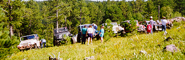

# Dakota Territory Challenge's Mount Moriah

   
Doug's Tuxedo Park Mark IV 

Our group from Old Miner finished up early, so most of us decided to check out Mount Moriah. Mount Moriah starts out with a rocky and muddy hill climb and continues on with some wicked off-camber sections. The hill climb isn't too tough, but the off-camber sections require careful driving.

After the off-camber section, I was heading down a steep decent when smoke started pouring out of my dash. I jumped out of my Jeep with my fire extinguisher in hand. The smoke had a foul smell and seemed to be coming from my engine compartment. I struggled for what seemed like hours with my hood lock (I now leave a key in it when wheeling). By the time I got the hood open, the quantity of smoke was dropping. It seemed to be coming off my exhaust manifold and it didn't take me long to figure out that it was power steering fluid. It turned out I had a pin hole in my high pressure hose that was spraying power steering fluid around the engine compartment. I was able to patch it with a spare hose clamp.

   
Strawberry Ridge 

We continued on and stopped on top of of Strawberry Ridge for a look out over the Valley and the town of Deadwood. Behind Deadwood, we could see a gigantic mine. It turns out is the worlds largest open pit gold mine in the world, they just keep finding more gold there.

On the descent from Strawberry Ridge, we stopped at a memorial to Teddy Rosevelt. Our tail gunner, Douglas Jones, entertained us with some amusing ghost stories from the town of Deadwood and we jumped in our trucks to finished the decent into town. Another great day of four wheeling!