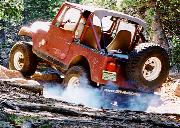

# Terry Howe's Trail Reports Page

(Eagle Rock, Colorado)

I am a member of Bighorn Four Wheel Drive Club and The Colorado Rock Hoppers as well as a member of the Colorado Association of Four Wheel Drive Clubs and United Four Wheel Drive Association. I wheel with Bighorn and The Rock Hoppers frequently and with people from the internet Jeep mailing lists. I also have some older trail reports from the East Coast when I wheeled with Long Island Off Road and Old Colony.

  * [Independence](https://www.outdoorwire.com/4x4/trail/report/co/penrose0001/) 1/23/00
  * [Hotel Gulch](./hotel0001/index.md) 1/9/00
  * [Chinamen's Gulch](./cg9911/index.md) 11/21/99
  * [Longwater Gulch](./longwater9910/index.md) 10/23/99
  * [Wheeler Lake](./wl9907.md) 8/7/99-8/8/99
  * [Die Trying](https://www.outdoorwire.com/4x4/trail/report/co/dt9907/) 7/31/99-8/1/99
  * [Bighorn:Wheeler Lake](./wl9908.md) 8/1/99
  * [Bighorn:Iron Chest](./ic9907.md) 7/18/99
  * [Blanca](./bl9907.md) 7/4/99
  * [Holy Cross](https://www.info2000.net/~cjnut/holycross.md) 7/3/99
  * [Bighorn:Spring Creek](./sc9906.md) 6/19/99
  * [Bighorn:Eagle Rock](./work9906.md) 6/9/99
  * [Bighorn:Moab (Warning: Big pix)](./mo9905.md) 5/15/99
  * [Bighorn:21 Road](./tr981205.md) 12/5/98
  * [Bighorn:Eagle Rock](./er981025.md) 10/25/98
  * [Bighorn:Moab Poison Spider Golden Spike](./mo980920.md) 9/20/98
  * [Bighorn:Moab Pre-Helldorado](./mo980919.md) 9/19/98
  * [Rock Hoppers/Bighorn:Blanca](./ba9809.md) 9/11/98-9/12/98
  * [Iron Chest](https://www.info2000.net/~cjnut/IC.md) 9/6/98
  * [Bighorn:Holy Cross](./hc9808.md) 8/22/98
  * [Bighorn:Blanca Peak](./b9808.md) 8/8/98-8/9/98
  * [Bighorn:Wheeler Lake](./wheeler9807.md) 7/19/98
  * [Bighorn:21 Road](./21r9807.md) 7/4/98
  * [Bighorn:Battlement Mesa](./bm9807.md) 7/3/98
  * [Bighorn:Hackett Gulch](./hg9806.md) 6/21/98
  * [Bighorn:Miller Rock Road](./mrr9806.md) 6/14/98
  * [Bighorn:China Wall](./cw9803.md) 3/15/98
  * [Bighorn:Tombstone Gulch](./tg9803.md) 3/29/98
  * [Bighorn:Las Cruces](./lc98_main.md) 2/19/98-2/21/98
  * [Bighorn:Texas Creek](./tc9802.md) 2/22/98
  * [Bighorn:Mad Dog](./md9801.md) 2/1/98
  * [Bighorn:Mad Dog](./md9802.md) 1/24/98
  * [Jeep-L:Mad Dog](https://www.info2000.net/~cjnut/md97.md) 11/29/97
  * [Rock Hoppers:Moab](./mo97.md) 10/3/97-10/6/97
  * [Dakota Territory Challenge](./dtc97.md) 8/29/97-9/1/97
  * [Bighorn:Mad Dog](./md97.md) 7/20/97
  * [Jeep-L:Hackett Gulch](./hack97.md) 6/19/97
  * [Rock Hoppers:Farmington](./cc97.md) 5/24/97-5/26/97
  * [Bighorn:Las Cruces](./lc97.md) 2/20/97-2/22/97
  * [Holy Cross City Trail](./hc.md) 10/20/96
  * [Jeep-L:Silver Creek Trail](./sil.md) 9/28/96
  * [Bighorn:Red Cone Peak](./bhrc.md) 9/22/96
  * [Old Colony:Northern Massachusetts](./oldflor.md) 7/4/96
  * [LIOR:Paine Hill](./liorct.md) 6/16/96
  * [Jeep-L:Pine Barrens](./pine4.md) 6/9/96,3/9/96
  * [LIOR:Fly Swatter Mt. Lamentation](./liorlament.md) 6/8/96
  * [LIOR:Ice Breaker Mt. Lamentation](./liorice.md) 3/16/96
  * [LIOR:Mt. Bezek](./liorbezek.md) 12/03/95
  * [LIOR:Pine Barrens](./liorpine.md) 10/22/95
  * [Old Colony:Old Florida Road](./florida.md) 10/8/95
  * [Old Colony:Southern Vermont](./svt.md) 10/7/95
  * [EC4W:Lamentation Mountain](./lament.md) 9/9/95
  * [Jeep-L:Catamount State Forest](./cata.md) 7/29/95
  * [Camping in The Pine Barrens](./pine3.md) 6/4/95
  * [Night trip to The Pine Barrens](./pine2.md) 5/28/95
  * [Jeep Jamboree-Pine Barrens](./pine.md) 4/21/95