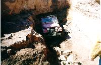
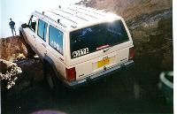
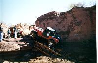
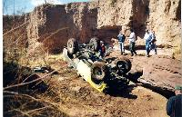
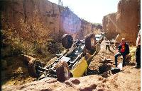
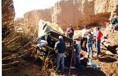

# Las Cruces '98: The Gauntlet

 

I always felt The Gauntlet (aka Coyote Canyon) was underrated. The trail has given me more problems than Wolf Run, Broad Canyon, or Amatista Ledges. Maybe it is just a wheel base thing since long wheel base has an advantage on the big ledges on The Gauntlet. Unfortunately, wheelbase didn't stop Greg from rolling his Toyota pickup after slipping off one of those ledges. 

The Gauntlet runs along a narrow canyon and features some big stone steps that Desert Mountain FWD club has built ramps on to make them possible. Each year these ramps wash out and the character of the trail changes. Heavy rains the night before left the canyon still very wet and muddy which made things just a bit more interesting. It got interesting quick when our tail gunner put a big hole in his radiator on the first obstacle and had to turn around. 

 The first obstacles where damage is common is a squeeze that has a reputation for cutting sidewalls and doing body damage. With twenty-two trucks on the trail, getting everyone through without some problems here proved impossible. I made it through clean this year, but two other trucks were not as fortunate. The damaged tires were quickly changed out or plugged to keep the group moving. 

 The mud on another squeeze obstacle caused the worse body damage for the day. To the right is a picture of Bob Norton shortly before putting a big dent in his drivers side door. It is rare to see a Cherokee on a trail like this and except for this incident, Bob proved to be quite nimble with it. 

 The trail features two water falls that the Desert Mountain FWD Club has built ramps up with just enough rocks to make it possible. The first water fall has the driver looking in the hole and the second gives the passenger the "view." Roll over here would be very unpleasant. 

 The only major casualty of the day was Greg's Toyota pickup. This ledge requires the driver to get on it and slowly work the front end to the right to make the sharp turn onto it. Greg was working the front end around when his passenger side tire slipped off and he rolled over onto the top. Greg crawled out, and luckily, he only had a cut on his hand where the windshield crushed over the steering wheel. 

 It wasn't long before we had him winched back up on the tires. After removing the shattered wind-shield, a Hi-Lift jack was used to increase the head room. The spark plugs were pulled and the engine was turned over to remove the oil that leaked into the cylinders. The trail leaders had oil absorbent materials and pails to clean up spilt fluids. After getting the plugs and wires back on right, Greg fired it up and found a better line up the ledge. He wheeled the rest of the weekend and his only complaint was about dust in the cab. 

