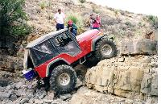
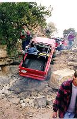

# Las Cruces '98: Habenero Falls

 

Near the end of Amatista Ledges is the entrance to Habenero Falls. Since there was still sun light, we decided to give it a look before calling it a day. After watching three out of six trucks suffer major breakage climbing the first ledge, I decided to leave this trail for another day. I wanted to do Tabasco Twister the next day and odds were I wouldn't make the first giant ledge without a strap and/or major damage. 

I watched two Scramblers attempt the climb, both of them broke their rear drive shafts. Two CJ-7s were able to make the climb thanks to 36+ tires, fuel injected V8s, and automatic transmissions. I was amazed the CJ-5 pictured above made the climb since short wheel base vehicles typically suffer on tall climbs, as you can see it is sporting some big meats. The early Bronco picture below is on the obstacle before the first ledge. He broke a front axle shortly after the picture was taken and he had to drive out in two wheel drive. 

