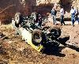

# Las Cruces '98: The Chile Challenge

 Phil Collard on Tabasco Twister

There were a lot of changes at this years Southwest 4 Wheel Drive Associations Winter Meeting in Las Cruces, New Mexico. The association was told only a few months before the event that the BLM was shutting down hundreds of acres of land which meant the runs that were planned for the area would have to be moved. The closure put an end to the infamous "Wolf Run" and "Guardian". The clubs in the area worked hard to develop new trails that could match the difficulty of the trails that were closed. Without a doubt, they succeeded.

 [The Gauntlet](lc98_gauntlet.md) 
I always felt [The Gauntlet](lc98_gauntlet.md) aka Coyote Canyon was underrated. The trail has given me more problems than Wolf Run, Broad Canyon, or Amatista Ledges [Amatista Ledges](lc98_amatista.md)
True to its name, [Amatista Ledges](lc98_amatista.md) begins with a drop off a ledge which leads to drop off after drop off. Picking the wrong line off one of these ledges could easily lead to a roll-over. [Habenero Falls](lc98_habenero.md)
I watched six trucks try the first giant stone step of [Habenero Falls](lc98_habenero.md). Three trucks made it, two broke drive shafts, and one broke a front axle. [Tabasco Twister](lc98_tabasco.md)
The [Tabasco Twister](lc98_tabasco.md) features a lot of good hard four wheeling and two extreme ledges to climb. Even our well prepared group had difficulties stomaching the heat of the [Tabasco Twister](lc98_tabasco.md).

### Trail Closures

The only way to stop [closures](lc98_closure.md) is by doing something about it. Please help keep the beautiful and challenging trails of Las Cruces open!

Glenn Wakefield on Tabasco Twister