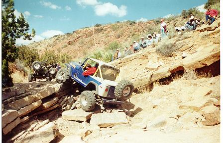
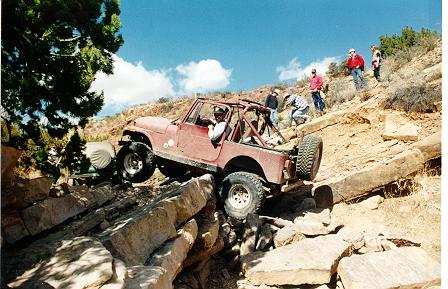
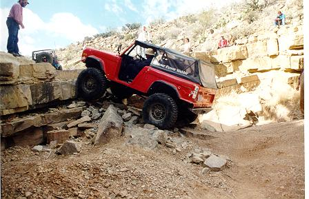
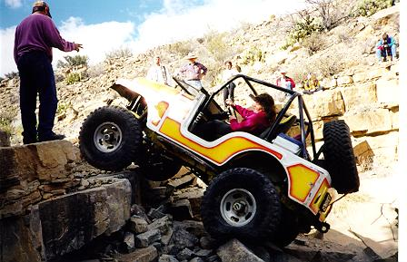
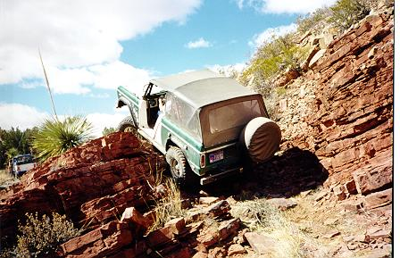
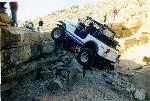

# Las Cruces '98: Tabasco Twister

Justin on the first ledge

It is a long drive over dirt roads to get to the trail head for The Tabasco Twister, but it is well worth the drive. Many of the big dogs showed up to run this new, challenging trail. I was one of the "runts" of the pack since I was only sporting 33s, fortunately I was near the end of the line, so I had plenty of time to evaluate the terrain.

 The trail starts with several very technical boulder fields that lead to the first big ledge. In order to make the ledge, you need climb up onto an off-camber section to the right. If you don't make it, you end up like the picture of me to the left. I spun around on the ledge like a top and high centered with both front wheels off the ground. I'm mainly caught on my spring hangers and my muffler there. My muffler partially ripped apart on that obstacle.

After the first big ledge, there are two off camber sections. The choice is to try to climb the rocks on the left or risk body damage by taking the off-camber line to the right. Without a spotter it is easy to fall off the rocks and get hung up and the off-camber line was slippery causing quite a few dings.

Pat Gramillion on the Abyss

After the off-camber sections was the second major ledge known as The Abyss. It is named the Abyss for the large wash out on the passenger side, falling in would be as good as bottomless. This obstacle proved difficult even for the big dogs. More people took the strap here than anywhere else, some walked right up it.

 It is rare to find women wheeling and rarer yet to find women wheeling extreme trails. Diane and her husband came all the way down from  Minnesota to wheel the trails and she proved herself very capable.

After The Abyss, there was ledge after ledge. None of the ledges could match The Abyss, but most were very difficult. Progress was slow and the strap was thrown more than once. With all the trucks on the trail, we didn't hit pavement until well after dark.

