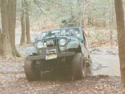
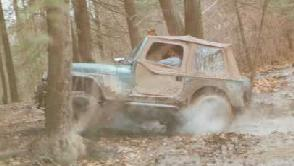

# Trail Report: LIOR Bezek Mt.

## by Greg Passannante

We got the run started at almost 11:00. There was a total of 22 trucks for the run, 7 of them were not members. There was quite a selection, from Jeeps to land yachts (only kidding Jim and Bob).

We headed out to the first cliff, on the way there was a little rock climb that most everyone made, and several decided to go around. We had to loop around the trail to go back and with this many trucks we were a little tight.

We backtracked to the beginning to take another trail. This trail has little more excitement. First was the mud hole which everyone just loves (right Keith and Erik). We decided to come back after we finished the trail.

the one wheel squeal

We headed around the mountain with some tight spots for the full sizes. We also came across single rocks that needed to be run over. The group came across the only real rock/mud climb with some challenges. We all watched Keith twist and break a perfectly good front driveshaft. Air, hard ground, and horsepower don't really go together.

Everyone made it under there own power one way or another, except the Pathfinder. He needed to be winched by Roger. This took a little longer with the 4-Runner's battery going dead (finally something wend bad for him). After the jump we were on our way.

The ski slope was in use so only a few trucks made it up there. We stopped for lunch in a clearing, and we met up with Jim O. He got the Bronco back together. After lunch we headed to the mud pit again. Everyone chose different routes some made them some didn't. We finally said our goodbyes and went to air up. Thanks for a great run.

finally out of the mud pit