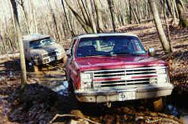

# Trail Report: LIOR Ice Breaker at Lamentation Mt.

## by Mark Sailer

It was a cold sunny Saturday morning, when the member of the Long Island Off Road Club head to Lamentation Mt. in Connecticut. Eight adventurous and "green" members met at the Commuter Parking Lot for a very exciting day. No one knew what we would find on the trails. With recent snow fall and cold temperatures it was sure to be a interesting ride. Mark, '86 CJ-7 - Trail Boss for this excursion, Mike and Randy in a Jeep "Mean Green Machine" Cherokee, John in a Wrangler, Frank in a brand new Montero, Eric in his Chevy Blazer, Bob Blair in his Full-size Ford Pickup, John, Toyota "I can do everything" Stock Pickup, as Tail Gunner. We headed out at 10:30 am to the trail head. 

Locked, low and ready to roll we hit the trail to find it snow and ice covered. Most low spots were filled with water and frozen over. The first real obstacle we came to was a rather large mud hole that was frozen over. I went over the ice cracking it as I went. no trouble. The Montereo was next and got stuck. No problem, time to show the "new guys" how to tug a vehicle out of a spot. Tug strap connected, ARB on, I back into the hole , John tied on the other end and out came the Montero. NEXT! The stock Wrangler got stuck too. Tug again ...... this is how it's done. Trail Lesson #1 - Lockers, Mud Tires and a tug strap make for easy vehicle extraction. Mike went next, work his way out, but almost lost his license plate. It was then we noticed how large and thick the ice blocks were that was holding us up. After Mike the Blazer got hung up and a HUGE block of ice in the hole and the rest of the gang had to use the go around. Too large and ice pack now..... SEND IN THE ICE BREAKERS! 

John gives Eric the strap 

The trail kept things interesting with water crossing, ice, mud and snow. I took a leg of the trail that I had seen during the September Trail Fest. As we weeded our way through, low and behold Terry Howe from NJ, caught up with us. He had worked till 3 AM on his Jeep and then over slept. The man is amazing. He remembered the directions to the trail head and followed our tracks and caught up with us. Now that his CJ is "Rattle Can " painted burgundy, I propose that his Jeep is named "Blood Hound". Threading the FULL size Ford Pickup through the turns and trees kept thing interesting. 

Next obstacle, a downed tree across the trail. The tree had broken off about 9 feet above the ground and was fairly rotted. But not enough to just push over. A bunch of the guys lifted the end and John guided me under the tree to turn around. We used my winch to pull down the tree and drag it to the side of the trail. Trail Lesson #2 - man power works wonders. 

Tree down, I turned around again, backing over the same log, but this time I got my axle hung up on the root end. Out came the jacks and boards and with some careful manipulation, up and over the end of the log to have hood gush with a cloud of steam. I had just over heated! HOW? For some reason the electric fan wasn't running. Out come the meter and my secondary battery was almost dead, only 5 volts. An OPTIMA dead?! I found the reason.... I must have kneed the switch to the battery manger and separated the batteries. No wonder the winch acted funny. No voltage, no fan, you OVERHEAT! Out came the tool roll to move the fan wire to the main battery. Randy, Mike's SO, commented.... "You have more stuff in that Jeep than I have in my garage". Trail Lesson #3 - Be Prepared with the proper tools and fluids/water. We had lunch, filled the radiator and scouted out the trail. There was too much tree down fall to proceed. Winter must have been pretty tough up there. Now to turn a round the line up. The toughest one was the Ford pickup. Way long! But after a 10,000 point turn we were on our way to the main trail. 

Mark over the squeeze 

Everyone did quite well up each of the obstacles. Even "cigarette lighter" was negotiated without a tug. Although Mike took the new chicken go-around. Onto the "Big Squeeze". After explaining what would happen and how to ride the rocks, I demo'd the squeeze, and everyone followed. The "stockers" were surprised at what their vehicles could do. DAMAGE REPORT: Bob's Ford Pickup pulled off the rear axle skid plate on the rocks. With the twisted skidplate remove we headed for the "Bath Tub". 

Bob just before the damage 

We stopped at the turn to exit the trail and walked to the mud hole. We really didn't wan to have to turn around all the trucks again if it was too deep. The trail to the hole was very muddy and extremely rutted. The trail was worse than the hole. Terry lead the pack through the hole, followed by the FORD. It was a very tight fit. Bob customized the shape of his rear bumper. Even the stock Montero made it through. The rest of us jumped in the trucks that challenged the hole, slogged through "Tire Bitter" ( no one got bitten this time) and to the top. It was very windy and cold, with the sun setting. Back down we went, gathered up the rest of the trucks and headed out of the trail. 

Terry into the pit 

It was a fun filled day, a bunch of trail lessons learned and no real tough break downs. We saw how well a stock vehicle can work and how each level of modification adds to the ease of getting through the trails. It was 2 weeks before I even attempted to wash to mud off. See Greg, I'm not such a clean nut. 

Happy Trails! See you next time out.