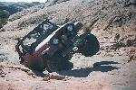
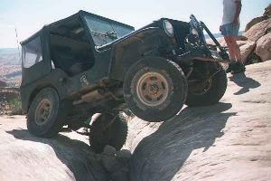
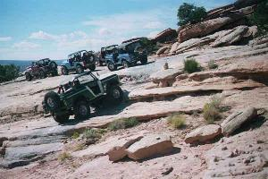
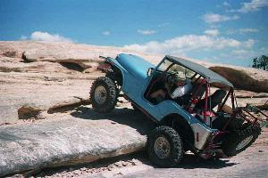

# Moab: Poison Spider Golden Spike 9/20/98

September 20, 1998  
by Cindy Beaudean  
  
   

Sunday morning we began our little adventure with Terry leading the pack... Those who followed were Roger, Ray, Leah, Rosie, Nathan, Paul, Cindy, and Dave brought up the rear...

Terry managed to get everyone's heart going...or is that stopped(?) when he did the crack on Poison Spider Mesa...All ended well and all four wheels did make it back to the ground safely. Roger and Ray had no  problems and then Paul gave it a try...and try he did until he twisted enough to have the clutch catch. He managed to get going again and made it up. As usual Dave made it look like a cake walk...slowly but surely he climbed up.

We stopped for awhile at the "pools" where Rosie enjoyed herself playing in the water in the bottom of the pools... 

We followed along enjoying the beauty of the area and headed for the crack on Golden Spike...we had come to an area where we had to climb some rocks when Paul called back to Dave and asked him if we had all wheels working...Dave called back and told us the bad news...NO!!! We later found out that thankfully we hadn't lost our lock-right but had broken an axle. Looks like the "Moab Curse" hit us again...this time on the first day. We continued and made it to the Golden Spike crack... Paul almost made it across but not quite...Ray pulled him over the last part of it...there we found another victim of the "Moab Curse" this guy had lost a rear wheel and stopped where he was...

 Continuing on we came across yet another "Cursed" vehicle, seems like it does attack when you least expect it.

While Roger and Ray played on Double Whammy, which no one managed to make up again, Dave was playing Good Samaritan to some wheelers from Tucson trying to repair a front axle.

We headed back to Moab for a dinner at Eddie McStiff's and if you should want your dinner just a little faster have Rosie ask the waiter for it...works for her...

We were also able to find out that the Broncos did beat the Raiders that day.

