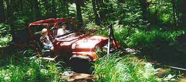
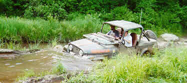

# Trail Report: Old Colony Northern Mass

## Day 1

Due to a new job and a move out West, time was running out for me and East coast four wheeling. I decided to go out with a bang and wheel with Rick Boiros and Old Colony Four Wheel Drive Club a few weeks before my move. Wheeling with Old Colony is always a challenge because the standard with them is 35s locked front and rear and my CJ has 32s and open front and rear. They also like to find the toughest wheeling in New England. 

I got up to the camp site late Wednesday night and it was pouring rain. Rather than set up my tent in the rain and sleep in a puddle, I was lazy and slept in the front seat of my Jeep. I woke up the next morning feeling surprisingly rested and met up with the Old Colony folks to hit the trails. It was still raining out, and it kept up all day, which made things just a bit more interesting. 

Around 10 in the morning we hit the trail and progress was slowed by the need to cut dead fall out of the way with a chain saw. This was a blessing for me since it gave me time to run out my winch cable in tricky spots and not slow the clubs progress that much. The guy in front of me quickly became tired of running my winch cable for me, so it was a good workout. 

On one hill climb, I blew my right front tire off the bead, but fortunately, Eric who was tail gunning and right behind me had on board air. Oh, did I mention I was second to last? Yeah, the trail was pretty chewed up by the time I hit it. Anyway, Eric cranked up his York compressor and I pulled out the Hi-Lift and got the weight of the wheel. He started airing and when the tire finally popped back on the bead, he was rewarded with a face full of mud. It was amazing how fast the York compressor aired that tire up, I still have to plumb mine some day. 

That was about the only mishap for the day that slowed us down. I also discovered that night that I broke off a shock and suffered a few minor dents and scratches. The day was over and I realized I hadn't taken a single picture because I was too busy winching. So it goes. 

## Day 2

Rain continued through the night, so I slept in the front of my Jeep again. The next day I was feeling a bit lazy, so I opted to ride shotgun with Eric. Eric's CJ-7 is built with 360, T-18, D300, Detroits f&r, 35s, basically the desired future state for my Jeep. The clouds broke and the sun came out which made I nice change from the constant rain. 

Life got interesting quick when we hit the Moss Bog. It's a very rare thing when someone gets through the Moss Bog without winching. It has also been known to take engines from those who try to hard. No one blew an engine, but no one made it through without throwing a cable. It's the first time I've ever seen Rick have to use his winch. 

We finished up the trails a bit early, so on the way home it was decided to run Old Florida Road. Rather than save the bottomless pit for last, we came in from the back side and hit it first. The Jeep Jamboree paved road on the right is the preferred route for anyone with any common sense and without 40+" tires, but what fun is common sense. With some goading, I convinced Eric to give the pit a try. The picture shows about as far as he got into it. He managed to go back and forth in the pit a few times before stalling out and not being able to restart. We winched him out and Eric had the pleasure of crawling under his dripping wet muddy Jeep to change out to a spare starter. I volunteered to do it, but he was too kind and I just had to hand him wrenches. 

The rest of the trail we finished up without problems. It turned out to be a lot more fun than I expected to ride. All the fun and no worries!