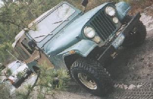
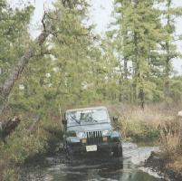

# Trail Report: Pine Barrens Jeep Jamboree

The Pine Barrens may not be as challenging as the slickrock of Moab, but hey, its only two hours from home and I bet they don't have as many mud pits and cranberry bogs in Moab. Its been very dry in Jersey this spring, so I was expecting this Jamboree to be a bit on the easy side. Instead of making it easy, the dry weather allowed us to take trails that were too wet last year.

I left early Friday(4/21) morning with my girlfriend Diane. I was driving my '81 CJ-7 and she was driving her '93 Wrangler. My roommate was overloaded at work, so he couldn't make it. I had just finished installing a 2.5" suspension lift and a Ford T-18 three days before, so I was a bit nervous about my untested vehicle. I also had gotten very little sleep that week since I'd been up all hours working on it.

By the time we got down there there were only spots available on the Pine Tree Trail. Since this trail was supposed to be the most difficult, Diane decided to ride with me. She just registered the Jeep the day before and she doesn't have much experience with standard transmissions. It is also a stock Wrangler with fairly bald tires.

The Pine Tree Trail was great, although it was a bit crowded. They had planned on running four trails, but they only ran three since two of the guides, Jeff and Julie from Maine, couldn't make it. There were about 27 Jeeps on our trail mostly CJ-7s and YJs, but also some CJ-5s, Cherokees, Grands, and a Wagoneer. I was babying my CJ all day, picking the easiest lines, since it was so new.

Extracting a ZJ with a my CJ

I was riding in the back of the pack. Behind me was the trail guide, in a CJ-7 with 33s, and his buddy in a CJ5 with 32s. They were fooling around a lot, backing through mud pits and things like that. One time the trail guide got stuck in this cranberry bog that the trail goes through. His front tires were completely submerged in water and mud. First he tried to winch off of me, but he just dragged me towards the hole. Then he tried to winch off a tree, but he had to back off that when it started to pull him over. Finally he got out by winching off another tree further away at a better angle. There were no casualties on our trail other than a few wet ignitions. Nothing a little wire drier couldn't handle.

The second day Diane wanted to take her Wrangler out, so we went on the Sandy Ridge Trail. It was supposed to be the easiest trail, but I figured I could find some fun somewhere. This trail did feature a sandy hill climb. Again we were riding in the back of the pack, so by the time we got to it it was pretty loose and rutty. A few stock Wranglers had to be Winched up. One CJ-7 stalled out and almost backed into a tree. I was able to make it up fairly easy thanks to my 32" mud terrains. Diane tried, but she got stuck at the top. She was able to back down and take a few more runs at it and finally made it up an easier line. I wish I had a run at it in a stock Wrangler, because it would have been real challenging.

Diane driving through an ex-cranberry bog

Late in the afternoon we were following a trail through another cranberry bog (factoid: New Jersey is the nations leading grower of cranberries). There was a long narrow trail through some very deep and soft mud. I followed a CJ-7 with 33s and lockers through this pit and then turned around and did it again and again. A Wrangler with 30" tires and lockers tried, but had to get winched out. The CJ-7 with lockers decided to have one more run at it, but by this time it was bottomless and he had to get winched out as well. This was the real initiation for my rebuilt CJ. There was mud everywhere including all over me.

All in all, it was a blast. My Jeep survived undamaged, but others weren't so fortunate. There were a total of three blown engines, all with bent and broken rods. This is the most I've seen on a Jamboree. Some people like to drive fast through deep water.