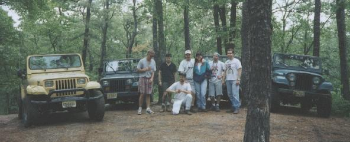
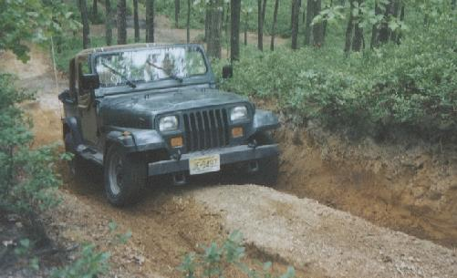

# Trail Report: Camping in the Pine Barrens

I organize a little trip down to the Pine Barrens for a weekend of camping. I took Friday off and pre-ran some trails on my own. Saturday, a bunch of us hit the trails.

 Here is a picture of all of us on top of Sand Hill the highest point in the Wharton State Forest (a 101 feet above sea level). Jeeps from left to right Don's '89 YJ, Diane's '93 YJ, Sean's '88 YJ, and Terry's '81 CJ-7. Humans from left to right Curt, Don, Terry, Sean, Christine, Rob, and Scott. Diane is taking the picture.

 Here is a picture of me trying to get Diane's stock '93 YJ up Sand Hill the hard way. I didn't make it, but it was fun trying. Maybe I could have made it, but I would have had to really beat on her Jeep. It is an easy climb with 31+ inch tires.

This was the trip that Don managed to finish off his front bumper and mangle his rear bumper. The front bumper popped off when he was driving through a mud hole. The rear bumper twisted up at a funny angle when I was pulling him out of another mud hole. I lost two out of the four transmissions to bell housing bolts on this trip. I replaced them after I noticed my transmission was flopping around a lot.