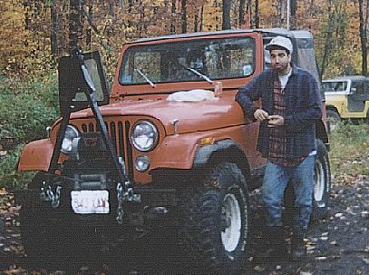
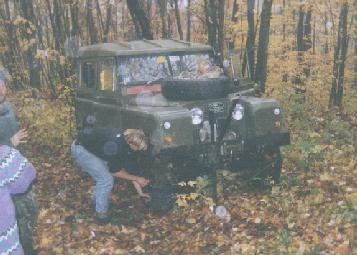
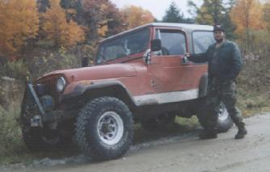

# Trail Report: Southern Vermont

After a lot of plotting a scheming, I managed to get an invite to tag along with the Old Colony Four Wheel Drive Club out of Massachusetts. Diane and I didn't make it to the campground until late Friday night, so Saturday morning arrived in a hurry. After a quick breakfast, I met Rick Boiros in person for the first time and soon everyone was lining up. Rick's club has been around for many years and all their Jeeps are seriously built. Most of them were equipped with a winch, running 33s or larger, and locked f&r. After the normal socializing and Jeep talk, we moved out for Vermont.

Rick and his '77 CJ-7

Well, I'm not sure if we were on state or national land, but the sign indicated it was legal for wheeling. We turned of the road onto a freshly graded trail to a cabin. After the cabin the road was ungraded and the fun began. I was the third or fourth Jeep from the front out of about 20 Jeeps or so and one Sammy. The first difficult obstacle and they had to get the strap out for me. I wasn't the only one to have problems with this obstacle plus there were a few mechanical problems, so it took a while for the pack to get moving again.

Eventually, everyone made it through and we headed up this trail the was rocky and muddy. This trail dead ended in a fairly recent area that had been logged. We paused here for lunch while the half the group continued down another more difficult trail. Finally, we all turned around and started after the rest of the group. I was now tail gunning so everything was real chewed up by the time I hit it.

This trail got tough fast, we were climbing up a slippery, rocky, tight trail. There is no way a full sized vehicle would have fit. Chris Komar, in his Land Rover with narrow 33s was the first to need to winch himself. Even with ARBs f&r he got jammed in a bad spot. He wasn't moving much further when he realized he had broken his front axle.

After a little discussion we decided to hang out and fix it. Chris was carrying, among other spare parts, the four different axle shafts for his Rover. The rest of the group kept moving and we could still hear them moving slowly over the difficult trail for the most of the hour and fifteen it took to repair Chris's axle.

 |  Chris pulling the axle from his Land Rover

By the time we were moving again, there were only four in our group. Rick Boiros was leading in his '77 CJ-7, Chris and Barbara in his Land Rover, Rich Banfield, president of New England Four Wheelers, in his '86 CJ-7, and me trying to keep up in my '81 CJ-7. The trail only got tougher from here. Rick didn't have any problem in his CJ-7 with 35s locked f&r, but Chris and Rich had to winch a few times and I had to winch 3 or 4 times. By the time we made it out of the woods, it was dark.

Rich and his '86 CJ-7

All in all the day was a blast. Very challenging wheeling with plenty of opportunity to try out my new winch (only two pulls before this weekend.) I was wheeling most of the day with 3 very experienced people and learned a lot about winching technique. I found it very difficult to winch with manual steering unless you have three arms. After the day was over I decided that Diane is doing all my winching if she is available.