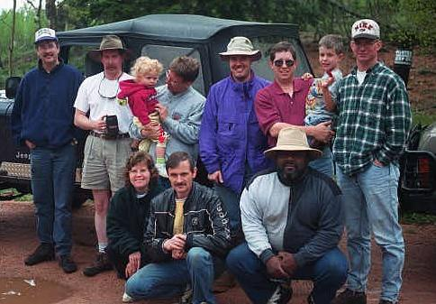
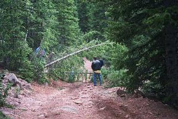
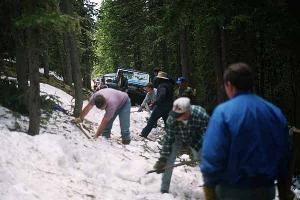
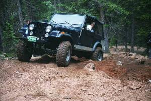

# Eagle Rock Work Trip 6/99

June 9, 1999  
by Cindy Beaudean  
  

Our gallant crew consisted of Ray, Curtis, Kevin, his wife Joanna and daughter Catherine, John, a guest, Mike and son Corey, John G., Paul, Jake and Dave V. 

We found the beginning of the trail needed some work and thanks to the fact that tree branches had been cleared from the road our work was a bit easier. We utilized the tree branches by putting them into the ruts to stop the run off from tearing the road up even more. As we worked our way up we continued to fill in ruts and clear branches out of the road way. 

 At the obstacle we found the bypass has become quite difficult now though not as hard as the main thoroughfare. John had just a bit of trouble with a rock...seems it liked a bit of his vehicle and claimed it. John Gamby tried the bypass and was able to make it up with a little work...once he get a lift on that Renegade and some lockers there will be not stopping him. Kevin also had some fun with the rocks and dirt but made it up with no damage. Ray, Mike, Jake, Paul, Curtis, and Dave made it up with no problems. 

 After having lunch we continued up to our "favorite" spot...the lean. It was covered with snow and Ray came very close to "meeting" a tree. We worked getting the road passable by clearing snow, building up the lower side with more tree branches and some rocks, hoping that it will fill in and the danger of sliding off that way will lessen. We got Ray out of his bit of tousle and down the road which after all of our work was a "bit" easier for the other drivers. The bog didn't need any work and as we were discussing what we were going to do it began to rain and the decision to go home was made. 

Thanks to all who showed up and for all your hard work... 

