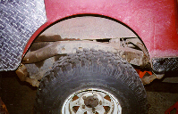
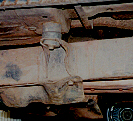

# Big Tire, Little Lift

 

The best set up for your Jeep is to use the least amount of lift possible to fit your target tire size. The less lift you have, the lower your center of gravity and springs with less arc flex better than springs with more arc. Besides suspension lifts, body lifts and fender trimming can be used to fit big tires. My goal was to fit 33s so that I could do all the hard trails with the least amount of lift possible.

### Suspension Lift

Everything being equal, a flat spring pack will articulate better than an arced spring pack because flat spring leaves are able to move equally well up and down. As the arc of a spring increases, it's ability to compress decreases. Spring lifts also increase your center of gravity since they raise the height of the entire vehicle.

Another disadvantage of tall springs is steep drive shaft angles. Steeper drive shaft angles can cause vibration problems and decrease u-joint life. Often, shims are used under the spring perches and transfer case lowering kits are added to resolve drive line vibration problems. The shims have a tendency to break and fall out. Large shims will starve the pinion bearing of gear lube and decrease its life. Sometimes the spring king pin will have to be replaced with a longer one when large shims are used. If the large king pin is not used, the axle housing may shift if the king pin does not have a firm hold in the spring perch. The transfer case lowering kits reduce clearance.

### Body Lift

 An advantage of the body lift is it does not raise the height of the engine, transmission, transfer case, or frame. Normally these are the heaviest parts of your Jeep. A body lift is better for your center of gravity than a suspension lift, but body lifts tend to allow more flex between the tub and frame. The more you lift your body, the more flex you get. A lot of flex will eventually rip body mounts off of the tub.

### Fender Trimming

Minor fender trimming is easy to do and it can be done so it is not at all noticeable. I've heard many stories of people who were reluctant to do fender trimming and ended up with a dented quarter panel when the tire made contact. Some minor fender trimming would have saved them expensive body work.

### The Solution

From talking with people over the net, I determined that it would take a combination of all three techniques to fit 33s on my CJ with the least amount of lift. I started with a 2 1/2" suspension lift, added a 1" body lift, and did some minor fender trimming.

 This picture was taken before I did minor fender trimming, and the picture above is after the fender trimming. If you look closely, you can see a line drawn in magic marker showing where the fender was cut. Once I painted the diamond plate to match the rest of the Jeep, the cut wasn't noticeable at all. I used a circular saw with a metal cutting blade to make the cut and touched it up with some paint.

Jeep CJs and Wrangler YJ tubs will need this piece removed to fit 33s, or a 4" suspension lift. A Wrangler might need more body lift to fit 33s with out hitting, but I'd be a bit reluctant to go over 1".

 When I switched rear axles to a Commando Dana 44 the tires rub a little on the inside of the fender since the Commando axle is about 1/2" narrower than my narrow track AMC 20. My front end is a Scout Dana 44 cut to CJ wide track specifications. My narrow track Dana 30 would allow the front tires to tuck right in, but the wider axle causes the front tires to rub the outside edge of the front fender. I just bent the fender out a bit to stop the rubbing. If you look closely at the picture to the right, you can see where I bent the fender out by hand, just behind the marker light. I used a rock to hammer in the inside edge of the fender. Eventually, I will chop the fenders for the [ flat fender](/body/ff.md) look.