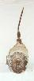
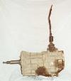
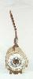

# AX-15

  

The AX-15 is a medium duty five speed transmission with an aluminum case. It is manufactured by Aisin in Japan and, although they are not compatible, the same model transmission is used in some Toyota trucks. In 1994 the clutch slave cylinder was moved to the outside of the bell housing, so these AX-15s have a different input bearing retainer to accommodate the different throwout bearing. The input shaft is also slightly different, so a different pilot bushing is used. All AX-15s have a 1 1/8" 10 spline input shaft and a 23 spine output shaft.

### Usage

The AX-15 was first used in Cherokees (XJ) and Comanches (MJ) with the 4.0L engine. In mid 1989, the AX-15 was used in Wranglers (YJ) with the 4.2L engine and it continued to be used with the 4.0L engine. The first year of the Grand Cherokee (ZJ), the AX-15 was rare option only with the 4.0L engine. The AX-15 is still used in TJs and XJs with the 4.0L engine.

| Transmission | 1st  | 2nd  | 3rd  | 4th  | 5th  | Rev  |
|--------------|------|------|------|------|------|------|
| AX-15        | 3.83 | 2.33 | 1.44 | 1.00 | 0.79 | 4.22 |