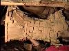
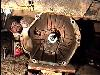
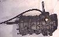

# Jeep Transmissions: AX-5

   

The AX-5 is a light duty five speed transmission. It looks similar to the AX-15, but smaller. It is manufactured by Aisin in Japan. The input shaft is 1" 14 spline and the output shaft can be 21 spline or 23 spline. 

### Usage

The AX-5 and the Peugeot BA 10/5 were used in all Wranglers from 1987-1989. After mid 1989, the AX-5 has only been used in 4 cylinder Wranglers (YJs and TJs). Its usage is similar in Cherokees (XJ) and Comanches (MJ).

The AX-5 from the front with bell housing and clutch slave cylinder installed. Friendly neighbor not included.   A driver's side shot of a BA 10/5 for comparison. Notice how the [BA 10/5](/transmission/factory/ba10.md) doesn't have the regular ribbing on the driver's side. The passenger side of the BA 10/5 does have regular ribbing. The main case of the BA 10/5 is made of two pieces bolted together, where as the AX-5 main case is one solid piece of cast aluminum.  

| Transmission | 1st  | 2nd  | 3rd  | 4th  | 5th  | Rev  |
|--------------|------|------|------|------|------|------|
| AX-5         | 3.93 | 2.33 | 1.45 | 1.00 | 0.85 | 4.74 |