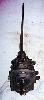
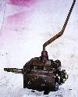
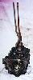
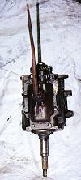
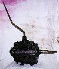
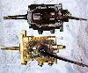

# Jeep Transmissions: T-15

     

The T-15 is a 3 speed transmission with a cast iron case. I has a casting number of T15 or 1307 and a 1 1/8" 10 spline input shaft. The T-15 has a 1 3/8" 6 spline output shaft. It has a reputation as the strongest of the 3 speeds.

 Top view of the T-15.  The casting numbers on the T-15 are on the passenger side near the top back.  Here's a top view of a T-90 and a T-15. The T-90 has an adapter on the front for the Dauntless V6, the adapter was probably originally on a T-86. The front of each transmission is even to show how much longer the T-15 is compared to the T-90. 

### Usage

The T-15 was used only in V8 equipped CJs and Jeep trucks from 1972 to 1975.

| Transmission | 1st  | 2nd  | 3rd  | 4th | 5th | Rev  |
|--------------|------|------|------|-----|-----|------|
| T-15         | 3.00 | 1.83 | 1.00 |     |     | 3.00 |