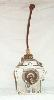
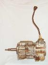
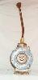

# Jeep Transmissions: SR-4 and T-4

  

The SR-4 and T-4 are light duty four speeds. Pictured is an SR-4, but they look almost identical from the outside. These transmission were manufactured by Borg-Warner and they often say Ford on the top cover. The case is aluminum and the casting numbers on the drivers side are 13-32 for the SR-4 and 13-51 for the T-4.

The T-4 and SR-4 use a 1 1/8" 10 spline input shaft when they are used with the I6 and 1" 14 spline input shaft when they are used with the I4.

### Usage

The SR-4 is a light duty transmission used only in 1980 and 1981 in the 151 and some 258s. The T-4 is also a light duty transmissions used from 1982 until 1986.

| Transmission | 1st  | 2nd  | 3rd  | 4th  | 5th | Rev  |
|--------------|------|------|------|------|-----|------|
| SR-4         | 4.07 | 2.39 | 1.49 | 1.00 |     | 3.95 |
| T-4          | 4.03 | 2.37 | 1.50 | 1.00 |     | 3.76 |