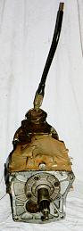
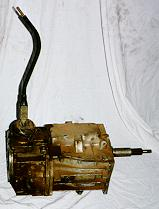
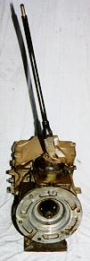
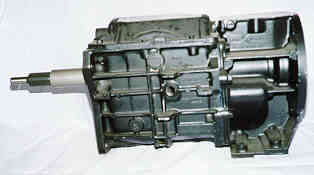
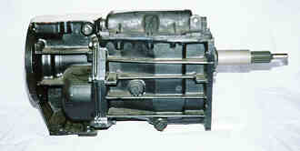

# T-5

  

The T-5 is a light duty transmissions five speed transmission that looks very similar to the SR-4 and T-4, except for the bulge the shift lever housing for the overdrive. The T-5 also looks about 10% bigger all around than the 4 speeds. This transmission was manufactured by Borg-Warner and may say Ford on the top cover. The case is aluminum and has a casting numbers on the drivers side of 13-52. The T-5 has a 1 1/8" 10 spline input shaft and a 23 spine output shaft.

### Usage

The T-5 was used in CJs from 1982 until 1986.

|  

| Transmission | 1st  | 2nd  | 3rd  | 4th  | 5th  | Rev  |
|--------------|------|------|------|------|------|------|
| T-5          | 4.03 | 2.37 | 1.50 | 1.00 | 0.86 | 3.76 |