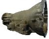

# Jeep Transmissions: TF 727

   

The Torque Flite 727 is a heavy duty Chrysler 3 speed automatic transmissions. They have an aluminum case and a 23 spline output shaft.

### Usage

The TF 727 was used in full sized Jeeps (SJs and J series pickups) from 1980-1983. From 1984-1992, the 727 was standard in trucks with the AMC 360 V8 and optional in trucks with the AMC 258. It uses the standard AMC bolt pattern. The case is 16" long and 14 bolts hold in the pan. 

| Transmission | 1st  | 2nd  | 3rd  | 4th | 5th | Rev |
|--------------|------|------|------|-----|-----|-----|
| TF 727       | 2.45 | 1.45 | 1.00 |     |     | NA  |