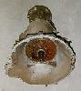
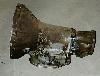
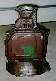

# TF904 / TF909

  

The Torque Flite 904 and 909 are light duty Chrysler 3 speed automatic transmissions. They have an aluminum case and a 23 spline output shaft. The case is ??" long and ?? bolts hold in the pan. The 909 is a 904 with a lock-up torque converter.

### Usage

The TF904 was used in CJs from 1980-1986 only with the I4 engine. From 1980-1983, the 904 had a Chevy engine pattern for the "Iron Duke" 2.5L. From 1984-1986 the 904 had an AMC pattern for the AMC 2.5L. The 904 was also used from 1984-1986 in XJs and MJs with the 2.5L and 2.8L engine. I'm not sure when they started using the 909 with the lock-up torque converter.

| Transmission | 1st  | 2nd | 3rd  | 4th | 5th | Rev |
|--------------|------|-----|------|-----|-----|-----|
| TF904        | 2.45 | NA  | 1.00 |     |     | NA  |
| TF909        | 2.45 | NA  | 1.00 |     |     | NA  |