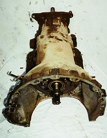
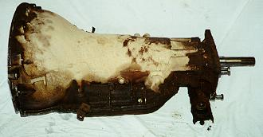
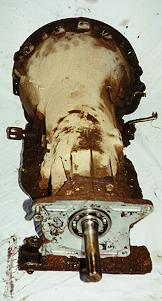

# TH 400

  

The Turbo 400 is a heavy duty Chevy 3 speed automatic transmissions. They have an aluminum case and two variations in output. Some Turbo 400s used in Jeeps were built to bolt to the Dana 20 transfer case and some were built to bolt to the BW 13-39 "Quadra-Trac" transfer case used during the 70s. The versions of the Turbo 400 are not compatible. The factory adapter used on the Dana 20 version of the Turbo 400 is light and prone to failure. The drive gear used with the Turbo 400 to Dana 20 is not 6 spline, so you cannot bolt a Dana 18 to this transmission. The case is 24 1/2" long and 13 bolts hold in the pan.

### Usage

The TH 400 was used in CJs with the BW 13-39 transfer case from 1976-1979. The TH 400 was used in full sized Jeeps (SJs and J series pickups) from the late 60s until 1979. The TH 400s used in CJs and later SJ had the AMC engine bolt pattern. In the late 60s the TH400 was used in SJs with the Buick 350, so it had the BOP/BOC (Buick, Olds, Pontiac, Cadilac) pattern. Some early TH 400s with the AMC engines used an engine to transmission adapter.

| Transmission | 1st  | 2nd  | 3rd  | 4th | 5th | Rev  |
|--------------|------|------|------|-----|-----|------|
| TH 400       | 2.48 | 1.48 | 1.00 |     |     | 2.08 |