# Swapping a CJ T-18 into a CJ

**by Kirk Beasley** [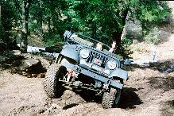](../../../img/transmission/updates/cjt18/kjb.jpg) 

The standard transmission for '76-'79 CJs with 232 I6, 258 I6 and 304 V8 engines was the T150 3-speed manual transmission. Although it is a strong transmission, its 1st gear ratio is 2.99:1. The Dana 20 transfer case used during this time has a 2.03:1 low and the typical axle ratio was 3.54:1. This combination gives these CJs the worst crawl ratio (21.5:1) Jeep ever built. Older CJs typically had lower axle ratios and newer CJs, YJs and TJs have lower transfer case ratios.

The T18A with 6.32 1st was a factory option from 1977-1979 giving the same Jeep a very respectable 45.4:1 crawl ratio, but I was not fortunate enough to have one in my 77 CJ5. After just a few months of hitting the trails, I decided I had to have one. The easiest and cheapest way to get a Jeep CJ T-18 seemed to be to find a 77-79 CJ donor and do a transmission switch. I searched the local papers for a couple of months until I found a winner - a rusty 1979 CJ5 sitting in an alley and it was less than two miles from my home!

Having both T150 and T18A factory setups allowed me to carefully compare the two and note how the factory installations differed. Some things are identical like the center floor cover and stick boots. The CJs frame, bell housing and skid plate are the same but have additional holes drilled for different configurations. The great thing about the T150 to T18A swap is it is a pure bolt on swap - no cutting, drilling, or welding is required.

### Weight

The T18A is a much larger and heavier transmission than the T150. I don't know the T18As weight, but with the D20 transfer case attached it broke a JC Whitney transmission jack rated at 250 lbs.

[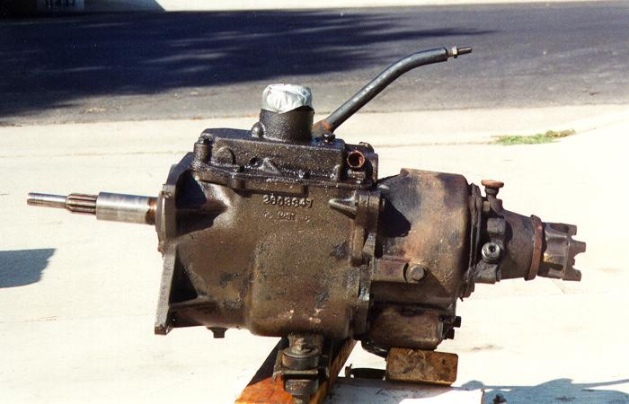](../../../img/transmission/updates/cjt18/t150-1.jpg) T-150 drivers side with Dana 20 transfer case [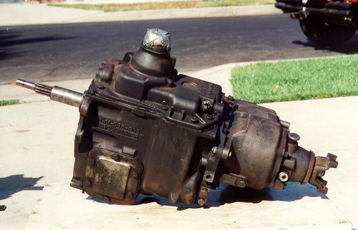](../../../img/transmission/updates/cjt18/t18a-1.jpg) T-18a drivers side with Dana 20 transfer case 

### Bell Housing and Clutch Linkage

[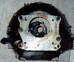](../../../img/transmission/updates/cjt18/bell.jpg) The bell housing is the same. Different holes are used to attach the two transmissions. The picture on the right shows the T18 bolts and stud installed in the correct holes for a Jeep T18 installation. [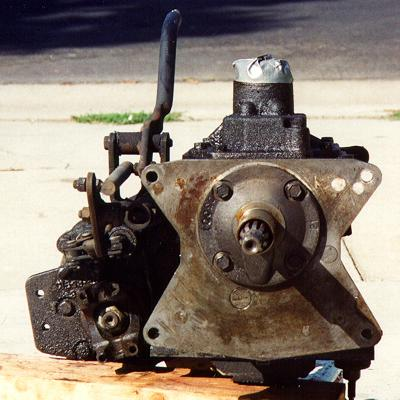](../../../img/transmission/updates/cjt18/t150-3.jpg) T150 bell housing bolt pattern [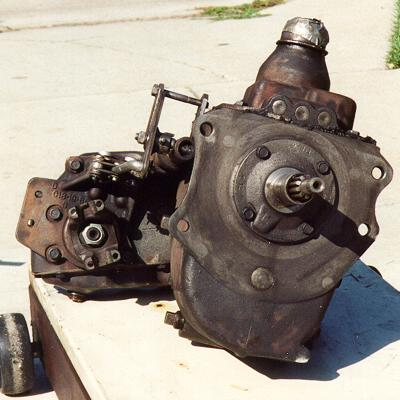](../../../img/transmission/updates/cjt18/t18a-3.jpg) T18 bell housing bolt pattern  [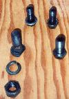](../../../img/transmission/updates/cjt18/nuts.jpg) The T150 attaches to the bell housing with four identical bolts, but the Jeep T18A is different. The top two bolts are the same as the T150 and use the same mounting holes. The bottom right bolt is larger and uses a different hole in the bell housing which is already threaded. The bottom left of the T18A is not attached with a bolt, but with a stud which is pressed from inside the bell housing. The stud has a large "D" head which butts up against a rib inside the bell housing to keep it from turning. The T18A attaches to this stud with a large washer and nut. [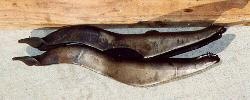](../../../img/transmission/updates/cjt18/throw-2.jpg) The odd bolt pattern of the Jeep CJ T-18 has the head of a stud right behind the clutch fork. The T18A clutch fork is identical to the T150 arm except its upper edge has been punched to clear the head of the stud. If you install a Jeep T18 and dont notch the clutch fork you may have a problem with the throwout bearing not being able to fully retract from the pressure plate.  
  
### Shift Levers

[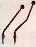](../../../img/transmission/updates/cjt18/sticks.jpg) The transmission shifter sticks are different and are not interchangeable. The T18 stick is taller and if you have a padded dash you will need to get used to using the heal of your hand to shift into first or else your fingers will pinched between the knob and dash. In the picture to the right, the T-150 lever is on the left and the T-18 lever is on the right.

### Transfer Case Linkage

The T18 requires an adapter to attach to the Dana 20 transfer case. The adapter is standard on Jeep T18s and is 1" thick. The T150 is 9 1/4 inches long and the T18A is 11 7/8 inches long. The extra length of the T18 plus the thickness of the adapter means the Dana 20 is sitting about 3 3/4" back. This causes the T18A Dana 20 transfer case linkage to be 4" longer than the T150s. The difference is the main linkage pipe which attaches to the Dana 20 and the lower rod which attaches to the Dana 20s two shift rails are longer.

[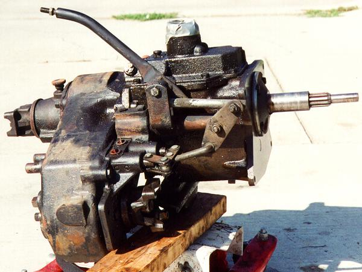](../../../img/transmission/updates/cjt18/t150-2.jpg) T-150 passenger side with Dana 20 transfer case [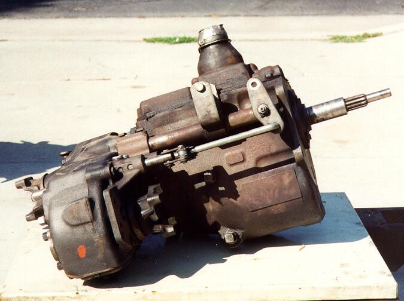](../../../img/transmission/updates/cjt18/t18a-2.jpg) T-18a passenger side with Dana 20 transfer case 

### Skid Plate and Transmission Mount

[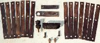](../../../img/transmission/updates/cjt18/shims.jpg) My factory 1979 T18A CJ-5 installation is lowered using seven 1/8" metal strips between the frame and skid plate. Note the distance between the skid plate and the rear spring hanger. Also note the T150s rear skid plate bolt becomes the T18s center bolt.

 Skid plate for T-150 with no shims  Skid plate for T-18 with shims 

The T150 and T18 torque brackets are very different. The T150 bracket is thin and wide. The T18 bracket is 1/4" thick. The T150 bracket bolts onto the bottom of the T150 and the T18 bracket bolts onto the bottom of the T18-D20 adapter plate. My 79 CJ5s T18 has another 1/4" spacer which fits between the torque bracket and the adapter.

[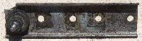](../../../img/transmission/updates/cjt18/t150-t_1.jpg) T-150 Torque Bracket [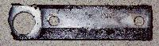](../../../img/transmission/updates/cjt18/t18-to_1.jpg) T-18 Torque Bracket 

### Drive Shafts

The longer T-18 transmission requires different drive shaft lengths. Drive shafts can be obtained from the donor or you can have your current drive shafts modified. The compressed lengths of the drive shafts are:

[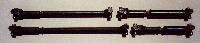](../../../img/transmission/updates/cjt18/shafts.jpg) 

| Transmission | Front   | Rear    |
|--------------|---------|---------|
| T150         | 26 1/2" | 18 1/4" |  
| T18A         | 30 1/4" | 14 3/4" | 
  
### Electrical

The wiring harness used in '79 CJs was different from the harness used in previous years. The '79 reverse switch uses a blade style plug and the pre '79 reverse switches use a post style plug. The reverse switches can be interchanged between the two transmissions. 

### Conclusion

I am very pleased with the T18A in my CJ5. It is a very worthwhile investment for anyone who takes their Jeep off-road.