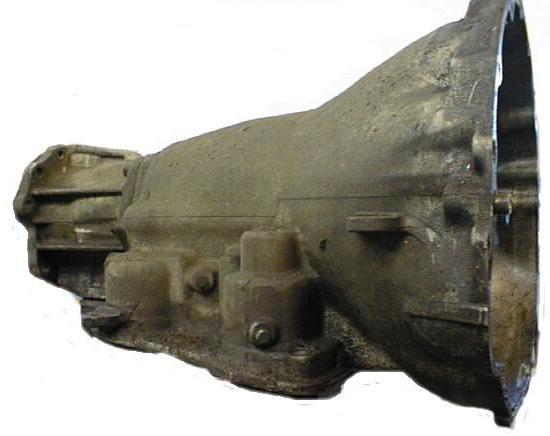
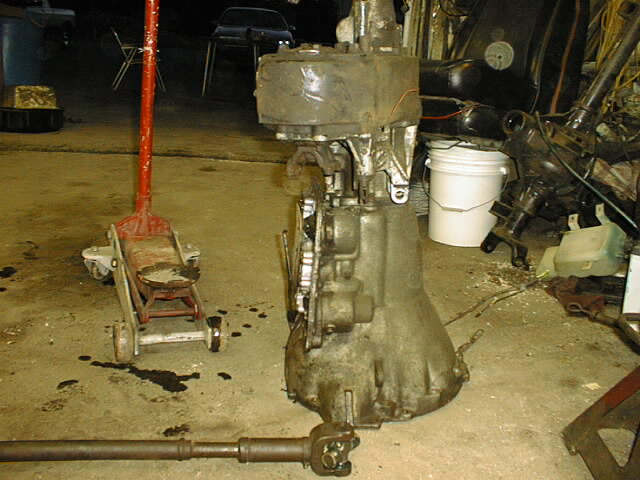
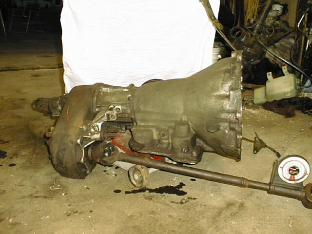

# Swapping an AMC 727 into a CJ

The Torque Flite 727 3 speed automatic is a good candidate for a low buck heavy duty automatic for CJs and carbed YJs. The TF 727 was used in full size Jeeps (SJs and J series pickups) in the 80s and early 90s. It has the standard AMC bolt pattern on the engine side and it has the circular bolt pattern and 23 spline output on the transfer case side. The transfer case bolt pattern for the 727 is the same as Dana 300, and most of the New Process transfer cases used in 1980+ Jeeps.

 Rick Boiros was kind enough to see how a Dana 300 and TF 727 fit together on his garage floor and take some pictures. The tricky part of this combination is the 727 comes from the factory with a New Process transfer cases which are drivers drop and the Dana 300 is passenger drop. The bolt pattern is the same, but the clocking of the transfer case is different. According to Rick the clocking of the Dana 300 on the 727 is pretty much set since there isn't enough material on the adapter to drill it for an alternate clocking.

 On a CJ, there is not sufficient clearance for the drive shaft with a stock suspension, but with a three to four inch lift and a dropped bump stop, the drive shaft will not hit the pan. The picture to the right shows the Dana 300 and 727 combination with a 6-8 degree angle on the drive shaft. This angle on the drive shaft gives keeps it clear of the pan.

Some people have reported using stock drive shafts with the TF727 swap. Mark Timon says with his 360 and TF727 swap, his rear drive shaft is 20.75" and his front drive shaft is 32.75". These are respectable lengths for a CJ-7 with an automatic.

A TF727 swap with a New Process transfer case is less of an issue since all New Process transfer cases used in Jeeps are drivers drop, so the clocking would be the same. Some TF727s are used with the NP208 which is a heavy duty transfer case that has a regular yoke output. If the 727 was going to be swapped into a YJ, it might be worth using the NP208 from the donor, since it does not have the slip yoke.

Probably the hardest part of doing a TF727 swap is getting the correct kick down linkage. Most full size Jeeps used the AMC 360 during the 80s and early 90s and most CJs and YJs used the AMC 258. The linkage is different and the proper linkage and proper adjustment of the linkage is essential to transmission life. If an engine swap is also planned to a 360 or 401, this will not be an issue.

A solution to the kickdown problem is swap in a kickdown cable for the TF727 which is available from Lokar Performance. Racing and hot rod suppliers list this cable in their catalogs. Tom Anhalt reports using it successfully in his '81 full size Cherokee with 258/TF727/NP208 combination. The cable was needed after swapping in a Mopar MPI kit on the 258.