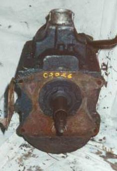
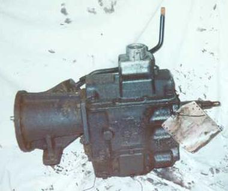

# NP435

 
(4WD version of the Ford NP435)

There are Ford, Chevy, and Dodge versions of the NP435. The best version for most Jeep owners would be the Ford version, but even this version has some variations in the crucial input bearing retainer size. The advantage of this transmission is the first gear is slightly lower than first on a wide ratio T-18. Second gear is also lower giving this transmission smaller a gap between first and second than the T-18.