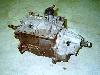

# Jeep Transmissions Conversions: NV4500

   

### NV4500 Pictures

 Here is a picture of the NV4500 Darren Perkins installed in his '82 CJ-7. Darren had to cut a notch towards the console to clear the shifter during installation.  This is Darren's NV4500 from under while bolted to the bell housing. Note the Advance Adapter tailhousing on the back and also the PTO cover on the right side. This is the 1996 4WD Dodge transmission with stock 23 spline output shaft. It's ready to bolt on a Dana 300\.  This is Jeff Layton's NV4500 from a 1992 2WD GM truck.  This is Jeff Layton's NV4500 from a 1992 2WD GM truck.  This is Jeff Layton's NV4500 from a 1992 2WD GM truck.  This is Jeff Layton's NV4500 from a 1992 2WD GM truck.  This is Jeff Layton's NV4500 from a 1992 2WD GM truck.  Here is a picture of Dave Peterson's NV4500 on the floor with a Dana 18 bolted on.  A picture of Dave's NV4500 from the front.