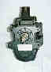
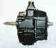
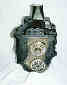

# SM-465

  
(Chevy SM465 before conversion)

The SM465 is the replacement for the SM420. It's first gear isn't as low, but it has a sturdier case and uses a larger input bearing. Input bearing retainer size may also be larger though, so finding a bell housing for anything other than a Chevy SB is not possible from the junk yard. It is also a bit longer than an SM420 which may be a concern for CJ-5 and earlier Jeeps.