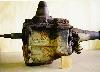

# Ford Transmissions

 

Many Ford transmissions are suitable for swaps into Jeep vehicles because many Jeeps used Borg-Warner and Tremec transmissions. Many Ford manual transmissions are compatible with the bell housings used on Jeep trucks.

Our intention is not to cover Ford drive train components in detail, but just provide some tips on what to look for in what trucks.