# Swapping a SM420 into a Wrangler

**by David Moulton** [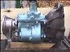](../../img/transmission/upgrades/sm420yj/trans20.jpg)

When my 4 cyl YJ's transmission started to grind going into 3rd gear I started to look for alternatives. The AX-5 that came in my Jeep and most 4 cyl YJ's is not a bad transmission for the stock Jeep, but when you swap on larger tires and start wheeling frequently, it is only a matter of time.

Since my Jeep is spending more time off road I wanted a transmission that could take abuse and enhance my Jeeps performance. After some research I decided on the GM SM420 transmission. This transmission was used on trucks up to 2 1/2 tons so it will stand up to anything my 4 cyl can throw at it.

### Pros

Besides the fact this transmission can take the off road abuse there are some other benefits. The first gear ratio is 7.05:1 vs the stock AX-5 first gear ratio of 3.93:1. This greatly increases off road performance when rock crawling, or tackling steep climbs and descents. This gives a much greater level of control, and eases the level of abuse to other components. The stock crawl ratio is 43:1 and the SM420 increases this to 78:1. A very significant increase!

With the clutch components used, you can kiss the troublesome internal slave cylinder good bye forever.

The overall length of the trans is shorter than the stock combo, the rear driveline can be lengthened about 3/4" of an inch. Every bit helps when dealing with a short wheelbase vehicle like a Jeep. Most other transmissions that offer the same benefits are longer than the SM420.

With this transmission, if you decide to swap in Chevy power at a later date you will be ready, only needing a bell housing and clutch component change depending on what engine you choose.

With the Advance Adapter kit , it is possible to switch to a Dana 300 transfer case just by switching the spud shaft that comes with the kit. Of course that would only be if switching the front axle to a passenger side pumpkin, as in a conversion to Scout axles.

### Cons

The street performance with the four cylinder will suffer a little, you seldom use 1st gear on the street, and there is a big gap between 3rd and 4th. You lose fifth gear altogether, but if you are running big tires then it's not used much anyway. First and reverse are non synchronized, you will have to be stopped for these to engage smoothly. Of course reverse isn't synchronized on the AX-5 either.

If you know anyone who has a truck with a truck transmission like this you might want to drive it first to see how it feels to you. The SM420 is an old truck transmission and it doesn't shift as lightly or as quickly as the stock transmission. Definitely not for drag racers.

It is louder than the stock tranny, especially first thru third. Fourth is about the same as the original transmission.

There is no provision for reverse lights on most SM420's so you will have to wire in a switch for this purpose.

Hard parts, like gears and shafts are no longer available from GM, but synchros, bearings and gaskets can be had from 4x4 shops such as Hicks 4x4, or Border Parts. However, the transmission themselves are cheap and if a gear or shaft is needed, a whole trans can be obtained for less than $100 US in most salvage yards.

### What to look for in an SM420

The SM420 was used in Chev and GM 1/2 to 2 1/2 ton trucks from 1947 thru 1967. There are some differences you might want to look for. I don't know the cutoff years but later SM420's have a front bearing retainer with an oil seal on the input shaft, earlier units have an [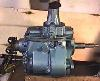](../../img/transmission/upgrades/sm420/4205.jpg) oil deflector that can't always do the job when being turned at the revolutions four cylinders are capable of. This results in a small amount of oil leaking out and while usually not causing any problem, it smells, and could find it's way onto the clutch, causing slipping problems.

Some SM420's have a tubular shifter and some have a forged shifter, the forged shifter is easier to bend, it can be heated with a torch and pulled into the position you want, whereas the tubular lever tends to collapse when bending. The shifter will have to be bent to give your hand clearance at the dash when shifting to first and third.

Very late SM420s have a reverse light switch.

### Bell Housing and Clutch

The bell housing used for this swap is the bell housing from an 1986 Chevy S-10 with a 2.8 V6 and a five speed. The hydraulic slave cylinder, pressure plate, throwout bearing, clutch release fork, and fork pivot ball from the S-10 are also used. The clutch disk to use is from a 83 Jeep CJ-7 with a 4 cyl engine. The original pilot bushing from the YJ can be used.

[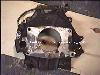](../../img/transmission/upgrades/sm420yj/trans28.jpg) Some of the original bell housing mounting bolts are too long and will have to be replaced. The bell housing has to have some modifications. The two lower transmission mounting holes have to be drilled out to fit the SM420 bolts, cap screws will have to be used because of the limited room inside the bell housing. I had to have the cap screws turned down to fit. It was suggested to have these holes spot faced in a milling machine for a flat contact surface with the screw, a good idea.

[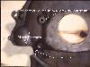](../../img/transmission/upgrades/sm420yj/trans35.jpg) The starter cone has to have a piece taken out to fit the Jeep starter. A new inspection cover will have to be made, or the S-10 or YJ cover must be modified to fit.

The clutch release fork, pivot ball stud has a thick washer under it, this has to be removed or the clutch fork will hit the pressure plate. I used Locktight on the ball pivot stud. I also ground off a small amount on the clutch fork at the top of the pivot ball divot for a little extra clearance.

### Crank sensor

A bracket must be made to hold the crank position sensor, I had a local machine shop do this, and took them the old bell housing for a guide. Of course they screwed it up and I had to reposition the hole when I put it in on a Saturday with the shop closed. This is very important to get right, in too far and the flywheel will eat your sensor, not enough and your engine won't run.

[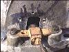](../../img/transmission/upgrades/sm420yj/trans25.jpg) [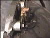](../../img/transmission/upgrades/sm420yj/trans30.jpg) [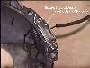](../../img/transmission/upgrades/sm420yj/trans34.jpg)

### Clutch slave cylinder

The transmission needs one of the mounting ears ground down a little for clearance when mounting the slave cylinder.

[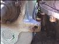](../../img/transmission/upgrades/sm420yj/trans24.jpg)Before [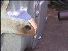](../../img/transmission/upgrades/sm420yj/trans23.jpg)After

[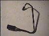](../../img/transmission/upgrades/sm420yj/trans7.jpg) A new line needs to be made to adapt the S-10 slave cylinder to the YJ clutch line. Since the 91's have the line as an integral part of the clutch master cylinder I decided to keep the quick disconnect and had a local hydraulic shop make up a line with fittings to mate the two together. I used a coat hanger bent to the shape necessary, and gave that to the shop for a guide.

### Transmission Tunnel

[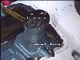](../../img/transmission/upgrades/sm420yj/trans9.jpg) A notch has to be cut in the floor pan for clearance of the shift tower, I cut two but believe now only one is necessary, see the picture for details. The tunnel cover also needs to modified for the new shifter position. The transmission lever also needs to be bent so that it will clear the dash.

### Skid Plate

The skid plate will need a notch cut for the transmission oil drain plug. This is at the very front of the skid plate and I cut mine with an angle grinder.

### Drive Shaft

The front driveshaft must be shortened 3/4", this is important, because the shaft if not shortened could be pushed through the transfer case, ruining the whole case. My rear shaft is a little too short but good enough. I am waiting to modify it when I do another lift in the future.

### Transfercase Mounting

[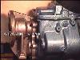](../../img/transmission/upgrades/sm420yj/trans37.jpg) The transfer case is adapted to the SM420 using Advance Adapters kit #50-9703, the kit uses the stock transmission mount and shift linkage mounts. The top two bolts of the transfer case shifter linkage are no longer used and the shifter is a little unstable, this could be fixed by using a piece of flat stock and running it to one of the transmission cover bolts. The shift lever comes through the floor in almost the same location as stock.

### Conclusion

That's about it, I love this transmission off road. It is just about bomb proof! The Swap is not difficult and was the first time I took out a transmission by myself. It does demand some caution in the placement of the crank sensor, and attention to details, but overall I consider it well worth the effort.