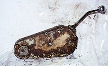
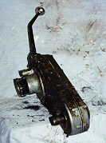
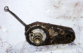

# Jeep Winches: Koenig Dana 18 PTO Adapter

 This is how the Koenig Dana 18 PTO adapter looks from behind. The adapter would bolt on at a slight angle so that the shift lever would be more upright.  From the side you can see how relatively thin the adapter is. A small chain inside the aluminum case takes power from the drive gear and transfers it to the PTO shaft gear.  Here is a front view of the Koenig Dana 18 PTO adapter. The light area is the input shaft for the adapter, the output is on the right.