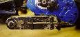
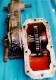
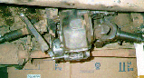
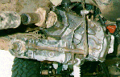
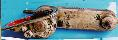

# Jeep Winches: Dana 20 PTO Adapter

 

Joe's Dana 20 PTO adapter is off a late 60s or early 70s Jeep pickup with a Dana 20. He guesses that a shorter version might have been available for CJs because this version puts the PTO shaft very close to the frame rail and it appears that the shaft will hit the cross member.

 The astute may notice that Joe's pictures depicting the the Dana 20 PTO adapter mounted to the transfer case actually show the adapter bolted to a Scout Dana 300. The adapter will NOT work on a Dana 300. The gear will not mesh properly and the casting of the case interferes with the operation. Joe bolted the adapter on the Dana 300 to illustrate how it attaches.

  
  
 

Matt O'Brien sent some pictures from his CJ-p5 that show his adapter bolted to a Dana 20.

 Front the front you can see the drive shaft going off to the PTO winch.  From the passenger side, the lever to engage the PTO is visible. Matt doesn't have all the linkage hooked up, so he enjoys crawling under his Jeep in deep water and mud to pull that lever.  From the rear you can see the lever to engage the PTO and the rear PTO output of the adapter. You can also see the ground clearance lost by the Dana 20 PTO adapter, it isn't nearly as bad as one would think it would be. The Dana 20 already has a deep oil pan and the bulk of the adapter is toward the high side of the transfer case.  From the drivers side you can see the front and rear PTO outputs for the PTO adapter and the PTO shaft going up front. 

## Identification Information

Some identification information off of the PTO adapters:  Matt's |  |  Transfer case adaptor |  Ramsey Winch / STC-2 / 73001   
---|---  
Chain drive cover |  STC-5W / 73080   
Joe's |  |  Transfer case adaptor |  Ramsey Winch / STC-2 / 73001   
---|---  
Chain drive housing |  STC-3 / 73002   
  
