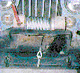

# Jeep Winches: Ramsey PTO Winch

 From this front view of the Ramsey PTO winch you can see the large red handle that engages and disengages the clutch for the winch. Pulling the handle one way allows the winch to free spool and the other way engages it to the PTO shaft. On the right side you can see the chain drive that takes input from the PTO shaft and transfers it to the winch spool. The PTO shaft in this application runs from the PTO adapter, along the drivers side, under the winch, and to the input of the winch. The maximum pulling capacity is 8000 lbs for this model on the first wrap of cable of course.

## Identification Information

This particular PTO winch has the following identification information on it:

    Model-# - BC246L628
    Capacity - 8000
    Chain cover # - 328085
    Drive cylinder # - 261