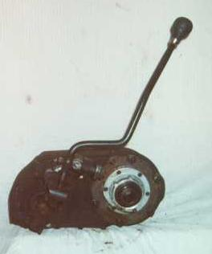
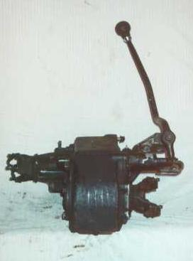
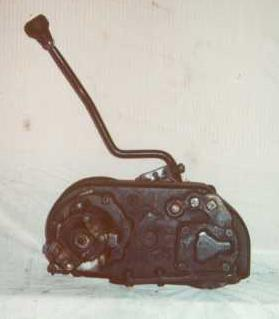

# Dana 300

  

The Dana 300 is a heavy duty gear driven transfer case that takes a 23 spline input shaft. The case is cast iron with a number C300-15 and the tail housing is aluminum. The output for the front driveshaft on the Dana 300 is on the passenger side and the rear output is centered. Low range is 2.62:1 and high is 1.00:1.

The bolt pattern is the same as many New Process transfer cases, but the drop is on the opposite side. Most New Process transfer cases used on Jeeps have the round bolt pattern and 23 spline input so it is compatible to some extent. The difference is all the New Process transfer cases are drivers drop and the Dana 300 is passenger drop. Some drilling and or tapping may be necessary may be necessary in the transfer case or the adapter to "clock" the transfer case. One bolt hole in the pattern is offset to allow the transfer cases to only be bolted on one way. The other option is to not use the bolt that clocks the transfer case.

One way people modify the Dana 300 is by adding oil paddles to the main shaft. The oil paddles prevent oil starvation of the rear bearing when flat towing. Another possible modification to the Dana 300 is converting it to [ u-bolt yokes](../upgrades/d300ub.md) rather than strap yokes.

### Usage

The Dana 300 was used only in CJs from 1980 until 1986. The first year the Dana 300 was available there was a slight difference from transfer cases used in '81-'86 CJs. The 1980 Dana 300 features a shorter tail housing which allows a slightly longer rear driveshaft.