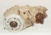
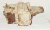
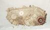

# Jeep Transfer Case: NP231/NVG231

     

The NP231 has an aluminum case and it should have a tag on the back saying New Process Gear, Model 231. New versions of the NP231 are refered to as NVG231 or NV231 which stands for New Venture Gear. The tag on the back of the transfer case will reflect the name change. Only the name is different. A NV231 HD model is used in some ZJs. Presumably this is a "heavy duty" version for Jeeps with the big V8s.

There are versions of this chain driven transfer case that take 21 and 23 spline input shafts. The 23 spline version is used behind the AX-15 and the 21 spline is used behind the AX-5 and the BA 10/5. The output for the front driveshaft is on the drivers side. Low range is 2.72 and high is 1.00.

If you own a 21 spline NP231 and you want to swap in a 23 spline transmission, you can either look for a cheap 23 spline NP231 at the junk yard or go to your local Jeep Parts Dealer and order up a new input shaft part #5300-6085. This is the part you need to convert your NP231 to 23 spline input.

### Usage

Since 1988, the NP231 has been the "Command Trac" transfer case used in Cherokees (XJ), Comanches (MJ), and Wranglers (YJ). It has been the "Command Trac" transfer case in the Grand Cherokee (ZJ) since its introduction. The new Wrangler (TJ) continues to use the NP231, but the NP231 used in the TJ has a different tail housing that allows the removal of the drive shaft with out losing transfer case fluid.

Both version of the NP231 used in the Wranglers have an over all length that is long for a short wheel base vehicle. This can cause driveline vibration and premature u-joint failure especially for a lifted vehicle. There are kits to convert the tail housing to a standard yoke to allow the use of a longer rear drive shaft. There is also a 4:1 low range reduction kit for the NP231. Wrangler are only available with "Command Trac", so the NP231 or NP207 are the only transfer cases available from the factory in any Wrangler model.