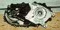
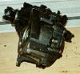
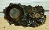
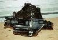
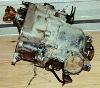
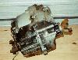
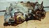

# Jeep Transfer Case: BW 13-39

   

Borg-Warners 13-39 transfer case was marketed as Quadra-Trac. It is different from Quadra-Trac found in later models. The BW 13-39 was only used with an AMC version of the GM TH-400 automatic transmission with a special long 10 spline output. It is not bolt compatible with any other Jeep transmission. Q-Trac is a full time four wheel drive system that directs power to the wheel with the least traction. There is an arrangement similar to an limited slip differential that splits power between the front and rear driveshafts. There is a vacuum operated emergency drive switch the locks the differential within the transfer case, so that power is sent equally to the front and rear axle. Differential locking is available for use in low traction situations in high and low range. Low range (2.57:1) is an optional unit that bolts to the back of the transfer case. There is a Mile Marker 16% overdrive gear and chain set available for the Quadra-Trac that effects high and low range and converts the transfer case for part time operation.

The Quadra-Trac is an chain driven transfer case with an aluminum case and it may have the casting number 13-39. The chain for the Quadra-Trac is known for its short life span. The output for the front driveshaft and the rear driveshaft is on the passenger side. The Dana 18 is a good candidate to replace a Quadra-Trac since the outputs are the same. A transmission swap or conversion would be required to swap in a Dana 18.

The transfer case in the pictures at the top of the page does not have a low range. It is a full time single speed unit. The pictures below show a transfer case with a low range.

 Drivers side view of the 13-39 with bolt on low range.  Passenger side view of 13-39 with low range.  View of the BW 13-39 with low range from the back.

### Usage

It was used in the CJ-7 from 1976 until 1979 and earlier in other models. It was introduced in the early 70s in full size Jeep trucks, but it was not used after 1979 in any Jeep trucks.