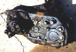
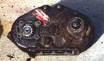
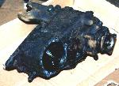
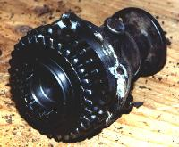
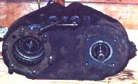
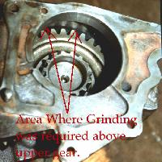
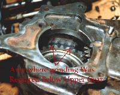
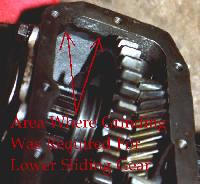

# 2.46:1 Low Range Dana 20

**by John Nutter**

 +  +  =
A Better Dana 20

The Jeep Dana 20 is one of the most common transfer cases around. It's cast iron housing and all gear drive make it strong, and the short tailshaft maximizes the length of the rear driveshaft. It also hangs down at a less steep an angle than a Dana 300, conserving valuable ground clearance. The down side to this transfer case is the 2.03:1 low range. A combination of gears from a Jeep Dana 18 transfer case and an older Early Bronco Dana 20 put inside a Jeep Dana 20 case can make for an almost painless conversion to a 2.46:1 low range.

#### The Numbers

Before I explain how to do the conversion I want to run through some numbers to show why the conversion makes sense. Take a look at these calculations for some common Jeep setups.

Transmission
(1st gear)  |  Transfercase
(low range)  |  axle gears  |  Crawl Ratio
---|---|---|---
T-150 (3:1) |  Dana 20 (2.03:1) |  3.54 |  21:1
T-150 |  Dana 20 (2.46:1) |  3.54 | 26:1
T-150 | Dana 20 (2.03:1) |  4.56 | 27:1
T-18 (6.32:1) | Dana 20 (2.03:1) |  3.54 | 45:1
T-18 | Dana 20 (2.46:1) |  3.54 |  55:1
T-18 | Dana 20 (2.03:1) |  4.56 | 58:1
T-18 | Dana 300 (2.62:1) |  3.54 | 58:1

As you can see changing from a 2.03:1 low range to a 2.46:1 low range has nearly the same effect as changing from 3.54 rear end gears to 4.56 gears, except that changing the transfer case gearing doesn't affect highway usage. Going to a 2.46 low range also yields nearly the same crawl ratio as if a Dana 300 was swapped in place of the Dana 20. The Dana 20 2.46 conversion should cost a lot less than buying a rare Scout II Dana 300 with the 6 spline input gear or buying an adapter for a T-18 to Jeep Dana 300. The Dana 20 or Scout II Dana 300 will also yield a much longer rear driveshaft than a T-18 adapted to a Jeep Dana 300.

#### Finding the gears

---
The desirable Early Bronco 33 tooth rear sliding gear is shown here with the Jeep rear sliding gear in front of it.

Jeep Dana 18 transfer cases can be found for sale used for very little money. You will want the later Dana 18 with the 1 1/4" center shaft. Make sure you get the input gear along with the transfer case because this will also need to be changed. It will be a bonus of you can get the twin stick shifters from the Dana 18 because these can be adapted to a Dana 20 with a custom bracket and linkages. Important note: There were production changes throughout the life of the Dana 18. Not all Dana 18 transfer cases have the right gears. Count the teeth on the gears to make sure you get the right transfer case. Spicer gear numbers will be stamped into the gear, ignore any cast in numbers.

gear |  spicer # | tooth count
---|---|---
input gear, helical cut|  18 8 23 |  29
high range output shaft gear, helical cut |  18 8 24 | 29
intermediate gear, both helical and straight cut |  18 5 9 |  18 straight teeth 39 helical teeth
lower sliding gear, straight cut teeth |  18 8 22 |  33

Finding the right Early Bronco transfer case can be a little trickier. Start by looking for one with the T style shifter pictured below. Count the teeth on the rear output sliding gear and make sure it has 33 straight cut teeth and the Spicer number is 18 8 58. This gear is the only part you will need from the Bronco Dana 20. Because you need only the one gear it may be possible to buy a damaged or partly disassembled transfer case to save money.

---
A partially disassembled Early Bronco Dana 20 with the T-style shifter.

gear |  spicer # | tooth count
---|---|---
Bronco upper sliding gear, straight cut teeth |  18 8 58 |  33

#### Putting it together

There are many manuals that detail how to disassemble and rebuild a Dana 20, you will need one of these. The best manual is the factory service manual for an Jeep CJ or full sized Jeep built between 1972 and 1979.

The main difference between this project and a stock Dana 20 rebuild is that the case had to be ground slightly for gear clearance. The upper and lower sliding gears in the 2.46 gear set are a bit larger than the stock 2.03:1 gears, and the case was not cast to accommodate them. Different Dana 20 cases will require different amounts of grinding. When discussing their new 3.15 gear set for Dana 20s Mepco mentioned that the Dana 20 cases from J-trucks seem to have needed less grinding. I also used a J-truck Dana 20 case and found that the grinding required amounted to little more than cleaning up casting flash. I have heard from other sources that CJ Dana 20 cases may require more grinding, but I can't substantiate that rumor through my own experience at this point.

I used an air die grinder with a carbide bur and a 4 inch angle grinder to do the grinding, and it went fairly quickly. I stopped during the process several times to check for clearances and in the end I ground more than I needed to just to be safe.

  

Here are some pictures that will give you an idea of how little grinding was required. Grinding was required only directly above and below the upper sliding gear and on the lip near the sheet metal cover for the lower sliding gear.

All the stock Jeep Dana 20 components are used except the gears. Except for the grinding the case is re-assembled as if it were stock.

#### Conclusions

This gear swap can be accomplished for far less money than it would cost to change axle gears or switch to a different type of transfer case. The exact amount it will cost largely depends on how much you have to pay for the rear sliding gear from the Early Bronco Dana 20. It is possible to buy a damaged or partially disassembled Early Bronco Dana 20 and save a lot of money. The only component needed from the Bronco transfer case is the sliding gear for the rear output, the condition of the rest of the transfer case doesn't matter.

I believe this gear swap provides the most bang for the buck for any Dana 20 equipped Jeep that needs a better crawl ratio, however the 3.15 gears from Mepco will offer a still lower ratio when they are released. A do it yourself type of Jeeper who is good at finding cheap used parts should be able to do this gear swap for a fraction of the cost of switching from 3.54 to 4.56 axle gears, but in low range it has nearly the same results as going to 4.56 gears. Swapping only transfer case gears also leaves high range the same for good freeway cruising.