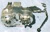
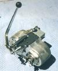
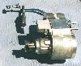
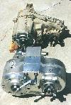
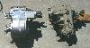
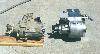

# Atlas Transfer Case

  

The Atlas transfer case is a new development from Advanced Adapters. It is gear driven with an aluminum case. The internals are similar to a Dana 300 except it has a low range reduction of 3.7:1 and lower. They have version for the Wrangler and should have versions for earlier CJs available at this time.  A front view of the Atlas transfer case and the NP231.  The Atlas and NP-231 transfer case from the drivers side.  The Atlas and NP-231 transfer case from the passenger side. Note that this NP-231 has a tail shaft shortening kit installed.