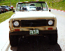
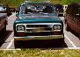
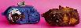
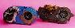
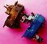
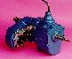

# IH Dana 300

The Dana 300 transfer case used in 1980 IH Scout IIs uses the same bolt pattern and input hole size as the Jeep Dana 20. It is a great transfer case to use as an upgrade to the Jeep Dana 20 because it has a much better low range. It is a gear driven transfer case with a cast iron case. Low range is 2.62:1.

The easiest way to tell the difference between a Scout Dana 300 and a Scout Dana 20 is by the shape of the head lights! It isn't a sure thing, but only the 1980 Scout II used the Dana 300 and that was the only year the Scout had square head lights. I wouldn't use the headlights as the only guideline, but they will give you a good idea.  A late 70s Scout II with round head lights.  Ken Farmer's 1980 Scout II with square head lights 

The head light trick is good for spotting a Scout Dana 300 from a distance, but it doesn't give positive identification. It won't help if you are looking at a transfer cases in a core pile either. There are some identifying features of the Scout Dana 300 that can be used to identify one in about any situation. There are several difference that make the Scout Dana 300 unique including: 

  * The speedometer cable attaches on the passenger side
  * Shallow oil pan
  * Does not use bottom bolt
  * Aluminum tail housing
  * Aluminum shift tower

 Looking at the speedometer cable attachment point is the easiest thing to check. Only the Scout Dana 300 (painted blue) has the speedometer cable attach on the passenger side of the rear tail housing. The Scout and Jeep Dana 20s and Jeep Dana 300s have the speedometer cable attach on drivers side of the rear tail housing. 

 This picture shows a Scout Dana 300 in blue and a Jeep Dana 20 which is rusty and dirty. It clearly shows the deep oil pan used in the Dana 20 vs. the shallow oil pan used on Dana 300s. The Jeep Dana 300 also uses a shallow oil pan. It also shows the missing lower bolt hole on the Scout Dana 300. 

 From the top you can see the aluminum tail housing and shift tower of the Scout Dana 300. The Dana 20s use a cast iron tail housing and shift tower. Often it is hard to tell the material used when for these parts when crawling under a truck, so this feature is probably the least useful identifying feature. 

Jeep T-18 and Scout Dana 300

 

## Swaps

[Swapping in the Scout Dana 300](/xfer/upgrades/scout300.md): General information on swapping in the 1980 Scout II Dana 300 into a Jeep vehicle.