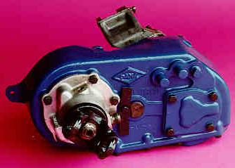
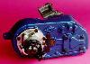
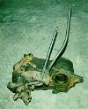

# International Havester Transfer Cases

International Harvester truck fans are big into line setting tickets. A line setting ticket identifies all the parts that were used to build the original truck. The line setting ticket uses special IH codes to identify these parts and this table has been compiled to cross reference those codes with the manufactures model number. If you purchase an IH truck it may come with a line setting ticket or you could still purchase the line setting ticket for your truck. The line setting ticket may still be in the glove box or behind the glove box.

## Scout Transfer Cases

IH Code| Vendor and Model| When Used
---|---|---
13143 or TC-143| IH Chain Drive Transfer Case-Single Speed| Scout II
13144 or TC-144| Dana Model 18| Scout 80
13145 or TC-145| Dana Model 20| Scout 800 and II
13146 or TC-146| Dana Model 300| 1980 Scout II

Disclaimer from Howard Pletcher: Years and Models are from memory, may not be 100% accurate.

## Identification

[IH Dana 300](ihd300id.md): The IH Scout II Dana 300 was only used in 1980 and it can be used to replace Jeep Dana 20 transfer cases. It has a much better low range than the Jeep Dana 20. The IH Dana 20 can be used to replace most Jeep Dana 20s. [IH Dana 18](ihd18id.md): The IH Dana 18 can be used to replace most Jeep Dana 18s.