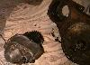

# Jeep Conversions: Saturn/Warn Over Drive

  

The Saturn Overdrive (originally produced by Warn) is a bolt on 0.75:1 overdrive for Jeeps equipped with the Dana 18 transfer case. It bolts on the PTO port on the Dana 18 and it works in all forward and reverse gears. There is a PTO adapter available for the Warn Overdrive that will allow you to bolt a PTO output to the back of the overdrive. Advanced Adapters lists the part, but has never produced it. It can be found used.

Talking with Paul Weitlauf, I realized there were more differences between the overdrives than I originally thought. I have a small hole Warn Overdrive on my CJ-2A and Paul has a big hole Warn Overdrive on his CJ-5. On his overdrive, the shift rail comes out the back of the case and on mine the shift rail comes out the front of the case.

 I double checked the Advanced Adapters catalog and they show an overdrive with the shift rail coming out the back of the case. I'm not sure if all the new Saturn Overdrives have the shift rail out the back or only the big hole units. A picture of Paul's overdrive is on the right.

Probably the most frequently asked question about the Warn/Saturn overdrive is, "How do I remove the overdrive?" Here are some instructions on [ how to remove](warnremove.md) it.

 