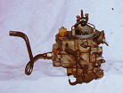
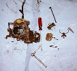

# Easy Fix for Jeep 258 Carter BBD Idle Problem
<H4>by [Terry L. Howe](mailto:txh3202@worldnet.att.net)</H4>

The Jeep 258 (4.2L) I6 isn't a power house, but it has gobs of low RPM
torque that makes it a great engine off-road.  The most common problem I
see with the engine is it's inability to idle.  Between the 258
in my '81 CJ-7 and a couple friends that have 258 equipped Wranglers,
I have fixed this problem half a dozen times and the cause of the
problem has always been the same.  The problem has always been caused
by clogged idle tubes that cause fuel to drip out of the venturis
and make the Jeep run rich at idle.
Fixing the problem is relatively easy and once you get past this
problem, you will get much more enjoyment from the 258 and the Carter BBD
carburetor.
The Carter BBD is a two barrel carburetor that was available on late
70s to late 80s Jeeps with the 4.2L engine.  There are two variations
of the carburetor, one is computer controlled and has a stepper motor
on the back side.  The computer controlled version was used after 1981.
Other than that, the two versions are the same although it seems the
stepper motor version is a bit more troublesome.
## The Symptoms
The symptoms of the problem include stumbling and sputtering at
idle.  In advanced cases, the Jeep will stall at every stop sign
and will only run at high RPMs.  Gas mileage will suffer since
fuel will just be sloshing out at idle.  Sometimes the idle
will be turned up to a high RPM to avoid the problem.  Typically,
the Jeep will run fine at higher RPMs (unless there are also
other problems.)
For a sure diagnosis, park the Jeep with the engine off and
remove the air cleaner cover.  There should be a plate over the
throat of the carb, the choke plate.  If you open the choke plate
you should be able to see down the throat of the carb and you should
see two screws with holes in the middle of them.  Next to them are
two passages with a nozzle in the middle of each.  This thing is
known as the venturi, when air passes by, fuel is supposed to be
drawn out through the nozzles.  If the idle tubes are clogged
fuel will drip from those nozzles during idle.
In order to see if fuel drips from the nozzles at idle, you must
start your Jeep with the air cleaner cover off and look down the
throat of the carb.  The Jeep Technical Service Manual recommends
that, when you do this,  you cover the air cleaner with a piece of
plexiglass since the engine can backfire through the carb and a
flame can shoot out.  Since I am reckless and like living dangerously,
I never do this.
After you have chosen the wise or foolish path, start your Jeep
and open the choke plate.  If your idle tubes are badly clogged,
you will see fuel dripping from the nozzles at idle (if your
Jeep will idle at all.)  If you don't see fuel dripping, but
your idle is still poor, open the throttle a bit with your
hand or have a friend hit the accelerator.  You should see two
even streams of fuel and no dripping from the nozzles.  Any dripping
means clogged idle tubes.
While you are doing this, make sure you don't put your hand or anything
else into rotating parts like the fan.  Keep your tie away from that thing
(some people just want to look good all the time.)  Same goes
if you are a "long hair, freaky" Tesla type.  All joking aside,
I've heard some bad stories.

## The Solution
Neither removal of the carburetor nor a complete rebuild is necessary
to fix the problem.  To fix the problem, start with you Jeep off and
parked securely:
- Remove the air cleaner cover and air cleaner.  You may need to remove
a few hoses and wires to get the air cleaner out of the way.
Make sure you tag them all so you can put them back in the right spot.
It's often easiest not to remove the heater hose that goes to the
exhaust manifold, if you have one.
- Remove hoop that holds air cleaner.
Remove the two screws holding the choke plate with a 3/16" socket or
small flat blade screw driver depending on what screws you have holding
it.  Be careful not to drop the screws down the manifold unless you
enjoy fishing.  Remove the choke plate.
- If your carb has one, remove the plate on the side that covers the
choke linkage so you can access the screw holding the choke rod.  It
may be necessary to drill out a rivet to get it free.
Remove the little snap ring and screw (1/4" socket) that holds the rod
that holds the choke plate and remove the rod.  A screw driver will
normally push off the snap ring.
- Remove the two screws with holes in the middle of them and carefully
remove the venturi cluster with the two little gaskets.  There should be
two idle pickup tubes pushed into the venturi sticking out of the
bottom. If they have fallen out, that could cause your idle problem.
Blast the venturi and inside of carb with lots of carb cleaner.
Be sure not to dislodge the check ball in the center.
- With a long thin pin or piece of piano wire, make sure the idle tubes
and nozzles are clear.  After you have run them through, spray with more
carb cleaner.
Put the cleaned out venturi cluster back with the two gaskets and two
screws.
- Replace the choke rod with snap ring and screw and replace the choke
plate.  Make sure all the screws are tight that hold together the carb
body at this time.  Often the screws will loosen up and dirt will be
sucked into the carb.
Replace the plate covering the choke linkage with a sheet metal
screw, or leave it off.
- Replace the air cleaner.
Smooth idle should have returned after this simple process.  If you
still have idle problems and don't have any dripping, make sure all
the vacuum hoses are hooked up and in good shape.  Also check for leaks
around the intake manifold or a loose carburetor.
To avoid repeated clogged idle tubes, drill out the idle tubes to
0.032".  This will greatly reduce the frequency of clogging and it
is a procedure that was actually recommended by Jeep for a while.
An alternative to removing the choke plate and all is to just remove
the top of the carburetor.  The advantage of this approach is you can
make sure there isn't a lot of junk in the bowls, you can check your
float adjustment, etc.  It also may help if you have power brakes because
the master cylinder may be in the way of getting the choke rod out.
## Contributor
Thanks to Randy Peterson for posting this solution a few years
back.  I've used it on various Jeeps many times since.