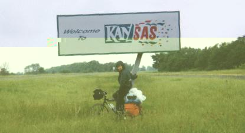

<TITLE>Terry's Bicycling Page</TITLE>
# Bicycling

Bicycling has been my primary hobby more than any other
hobby.  Lately biking has taken a bit of a back burner, I've
barely riden this year.  It is hard to find time to play
hockey two nights a week and keep the Jeep running *and*
ride.  Part of the problem, is most of the decent parks
in the area have been recently closed to Mt. biking.
I'm due for a bit of a biking break anyway, since
last summer I spent two straight months on my bike.
I have started on a trip report of my [odyssey](odyssey.html)
across the United Sates with Diane in the summer of 1994.
Right now I have two Trek 970s.  One is set up for offroad
with Specialized suspension fork and big nobbies. The
other is set up for touring with road slicks, bike rack,
and lots of water bottle cages.
- [Adventrue Cycling Association](http://outside.starwave.com/outside/online/organization/adv/main.html)
- [Bicycle FAQs](gopher://draco.acs.uci.edu:1071/00/faq)

<ADDRESS>
Author: Terry L Howe [(txh3202@att.net)](mailto:txh3202@att.net)
</ADDRESS>
Aug 16, 1995

