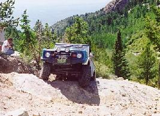
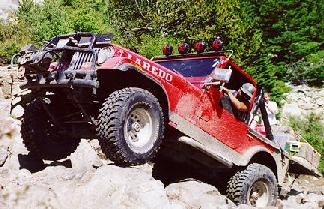
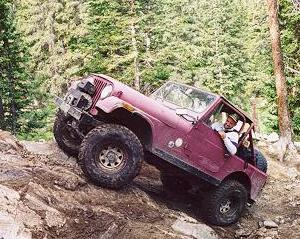
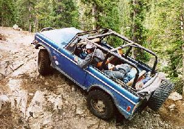

# Blanca Peak 8/98

August 8-9, 1998

by David Vest (Mud Dancer)

Myself, Curtis with friend Mike, Terry with friend Steve, and Ray met at
Southgate and departed around 8:10 am Saturday morning for Blanca Peak.
We traveled down Hwy 115 toward Westcliff.  From there we proceeded over
Medino Pass, through the Sand Dunes to the Blanca Peak trail head. 
I was very surprised at how little water we encountered considering the
rain we've had.

At the Blanca Peak trail head we met Bill and Glenna
Donahue, they had been guests at the August 5th club meeting.  Bill was
driving his well equipped '85 CJ7 and ready to conquer the Peak for the
first time.  Terry also was a virgin of the Peak and looking forward to
it.  We headed up the trail, stopping a couple of times for Ray whose
Bronco was vapor locking on him.

We arrived at Jaws 1 without incident
and after everyone made it over without problems we continued up the
trail to Jeep Rock.  At Jeep Rock both Jeeps on the trip had to receive
a little assist to get over, I guess that is why it is called Jeep
Rock.

We continued up the trail, successfully tackling the remaining obstacles
without incident.  We crossed the four or five slide areas, from earlier
this year, I find that they just add a little more character to the
trail.

After arriving at Como lake, we set up camp and enjoyed an evening of
BSing around the camp fire, courtesy of Bill who brought the wood.
After retiring for the evening we were blessed with the yelling and
occasional gun shot from a very inconsiderate group of four wheeler
want-a-be's until 2 or 3 am.  It is people like this that give the rest
of us a bad rep.

Sunday morning we got up, broke camp, lined up and
waved good bye to the Colorado Four Wheelers who had also made the trek
up the Peak for the weekend (they were not the rowdy bunch) and had
camped on the far side of the lake.  After they had passed we went
around the lake and headed on up to the upper lake.  After we all had
some difficulty getting up the rock, we enjoyed the views and remaining
drive to the upper lake.

The marmots were more plentiful than usual,
or so it seemed to me.  At the upper lake, everyone except myself, Bill
and Glenna hiked up to the third lake.  When they returned, we headed
back down the trail, stopping at Jaws 1 for lunch.  After once again
arriving at the trail head, we aired up and headed for home.  I do
believe a good time was had by all and the knowledge that we once again
conquered the Peak will stay with us until next time.

