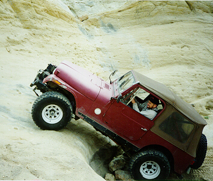
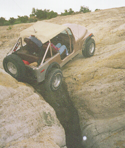
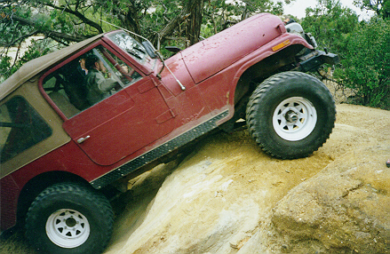

<TITLE>Trail Report: Rock Hoppers:Farmington, NM</TITLE>
# Trail Report: Rock Hoppers:Farmington, NM

Here's a shot of me going up "No Fear" the easy way.  The hard
way can be seen behind me.  Next time I'd like to try the hard
way, but Dennis went up the hard way and broke a u-joint.  It
was first thing in the morning first day, I didn't want to ruin
the weekend.  Note the big goofy grin I have.

Here's a shot of Phil, our trail guide, going over "The Abyss".
This obstacle is kind of like Golden Crack, but much deeper and
with a drop off on one side that could send you in a long roll
into the canyon.  Sorry 'bout the fuzzy picture, it was late
and raining at the time.

Here I am on one of the big stone steps on RJs trail.  This is
just before my steering shaft popped apart and Matt and I spent
time putting it all back together.
One of our trail guides from the Cliffhangers, Rhonda, broke the
main shaft of her Dana 20 in her CJ-5 on the Waterfall trail.  Didn't
think you could break a Dana 20.

<ADDRESS>
Author: Terry L Howe [(txh3202@worldnet.att.net)](mailto:txh3202@worldnet.att.net)
</ADDRESS>
June 7, 1997

