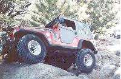
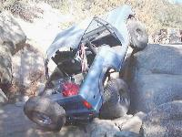
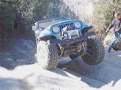

# Chinamen's Gulch 7/4/99

November 21, 1999

by Terry L. Howe

Terry tries the hard way

|  | John Heskett and Kevin Whitt from Bighorn and Sean Lazelle and Scott Riebel
from the Rock Hoppers met me at 8am at Red Rocks Shopping Center for the
Chinamen's Gulch trip.  We headed West and met Bill Graham out in
Johnsons Village.  As soon as we were ready, we hit the trail.

On the first optional obstacle, everyone decided to give it a try.
Everyone managed to get through, but Bill broke the welds on his bumper.
Scott broke out his on-board welder and fixed it up and we headed down
the trail.

At the next obstacle, a few of us tried the hard way up Whale Rock, no one
made it.  A relay on Scott's ARB got jammed, but no one could figure out how
to fix it.  He managed to get up the second hardest line without a front
locker.

We all motored through upper Chinamen's and stopped at the bottom for lunch.
After lunch we hit the rest of the lower section.  Sean seemed to get stuck
a bit on the last obstcale, but he finally made it through. |
| --- | --- |
|  |  |  |