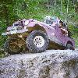

# 1997 Dakota Territory Challenge

|  | Iceman
The first major obstacle was optional and about half the people skipped
it, but after that we started hitting obstacles that weren't
optional.  The Iceman
struck fast freezing us
in our tracks. |
| --- | --- |
|  | Old Miner
After Carbonate, we dropped into Chism Gulch and stopped for lunch
at the base of Heckman Hill, aka Widowmaker Hill.  Heckman Hill is
the most challenging part of the Old Miner and it
requires lots of throttle no matter what modifications you may have made to your
vehicle. |
|  | Mount Moriah
Mount Moriah
starts out with a rocky and muddy
hill climb and continues on with some wicked off-camber sections.  The
hill climb isn't too tough, but the off-camber sections require
careful driving.  After the off-camber secion, I was heading down
a steep decent when smoke started pouring out of my dash. |