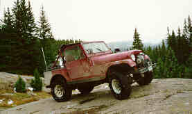
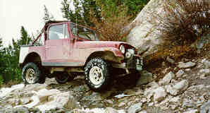

# Trail Report: Holy Cross City Trail

Diane and I decided to go to the Holy Cross City Trail
on the spur of the moment, so there wasn't time to get anyone to
go with us.  We found the trail head and started up the rough and rocky road.
There were a couple real challenging spots, especially with patches of
heavy snow.  On the way up we went past another entrance that was
higher up on the trail.  We crossed a stream and I was having a real
tough time getting through due to deep snow and big rocks.  It was
just before the turn off for the hiking trail.  I hiked up a bit and
it didn't look like it was going to get much easier. We decided to
turn around since the snow was deep, it was snowing, and it was around
3:00 in the afternoon.  On the way down, we stopped for a snack and
I coaxed a camp robber jay on my hood with a piece of bagel.  After
the all three of us were sated, we headed out.  It was lots of fun
and I'm looking forward to next summer when I can give it another
shot.

---

Author: Terry L Howe [(txh3202@worldnet.att.net)](mailto:txh3202@worldnet.att.net)

September 22, 1996

---