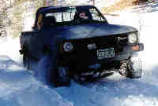
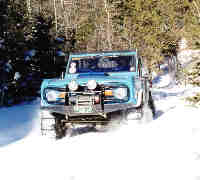
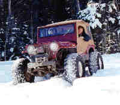

# Hotel Gulch Trail 7/98

|  | January 9, 2000
by Terry L. Howe

It was a typical cold day in January when we met at 8am at the Red Rocks
Shopping Center.  Dave and Kelly arrived in their Jeep Cherokee, Paul
showed up in his Toyota pickup instead of his flat fender, Curtis, Connie,
and Brooke were in their Bronco, and I was "leading" in my CJ-2A.
We headed up to Hotel Gulch which runs from rt 67 to Rampart Range Road.

We arrived at the trail head, locked them in, aired down, and put on chains
if available.  We got to the point in the road where it was no long plowed and
I jumped in.  I didn't get far before it got pretty hard.  I was a bit reluctant
to drag every down the trail, so I backed out.  Dave decided to give it a
try and made some good progress.  We decided to head up.

The snow was sugar snow and not crusty at all, so traction was very poor.  Dave
was leading most of the way until his trans got hot and he decided to let
Curtis lead for a while.  Curtis is locked up and had chains on all fours, so
he was moving pretty well.  Paul was bouncing around with the pickup being
open all around and not having a real aggressive tire.

We made it pretty far, but it wasn't getting easier.  We decided to pause for
a while and turn around.  Going out was easy since it was all down hill.  We
got out of the trail by about 1pm and everyone packed up and aired up.  Another
fun day of wheeling. |
| --- | --- |