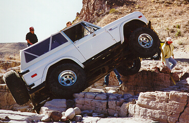
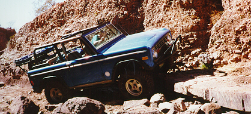
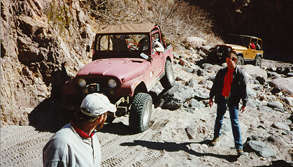

<TITLE>Trail Report: Big Horn:Las Cruces</TITLE>
# Trail Report: Big Horn:Las Cruces

Pat gets major air driving over the Pickle Barrel on the Broad Canyon Trail.
After the strap was applied to prevent rollover, he continued through the
obstacle.

Ray driving over one of the stone steps on the Wolf Run.
Wayne Bennett (aka Flatlander) covered our trip through
[Wolf Run](http://www.4X4NOW.com/nmlc7c.html)
on his [4x4NOW web page](http://www.4X4NOW.com/).
He included pictures of three Big Horn 4x4 club members: Ray Bork (Blue EB),
Dave Vest (Green EB), and Chris Long (Blue YJ), but none of me.
He also covered our run in Alamagordo, [The Gauntlet](http://www.4X4NOW.com/trnmg.html).

The approach to some obstacle on Broad Canyon Trail.

<ADDRESS>
Author: Terry L Howe [(txh3202@worldnet.att.net)](mailto:txh3202@worldnet.att.net)
</ADDRESS>
Febuary 23, 1997

